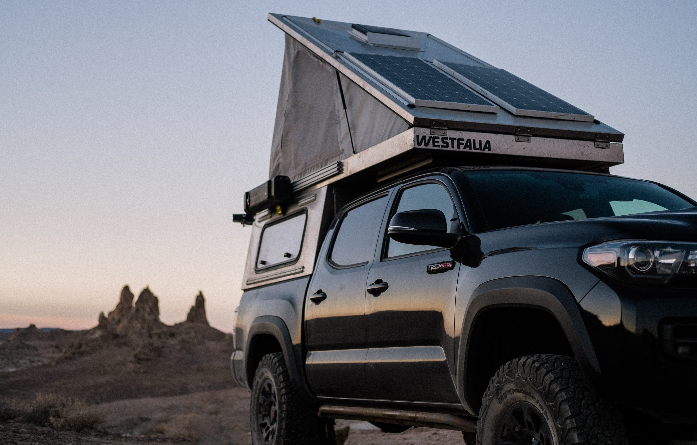
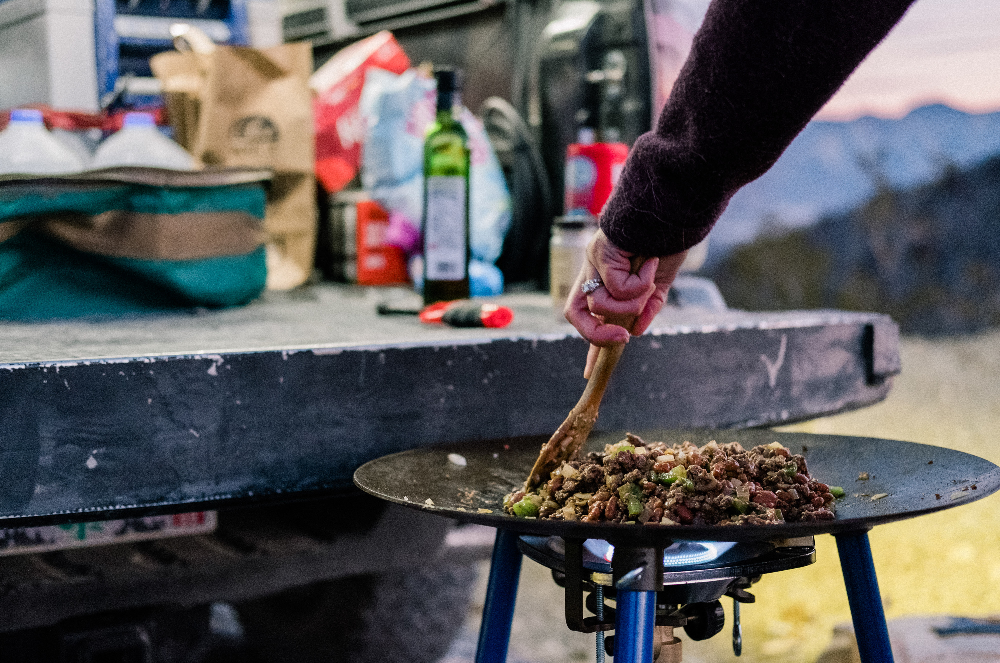
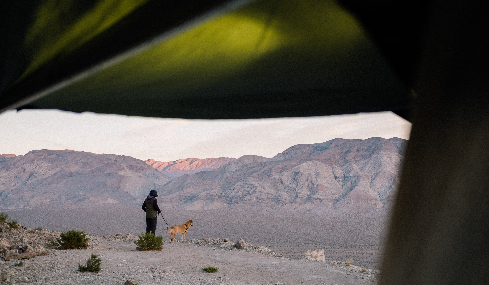
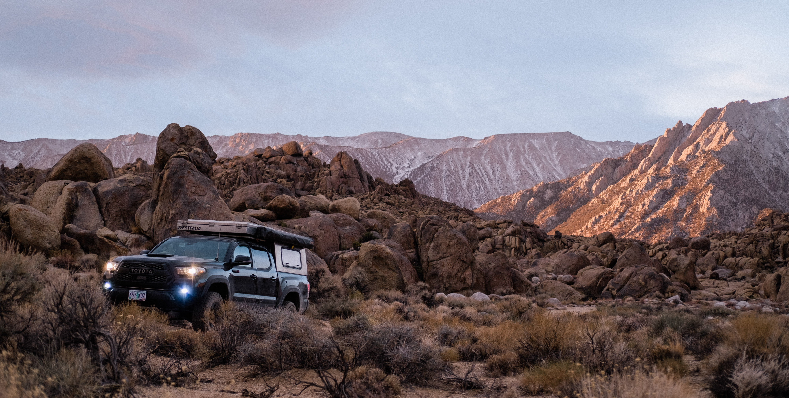

The stars aligned and our new friend
[Brian](https://www.instagram.com/danneskjold01/) decided to sell his [Vagabond
Outdoors](https://vagabondoutdoors.com/) camper at the exact same time that we
were looking to buy one. We were actually on the waitlist for a similar camper
for 8 months already and cancelled because we got tired of waiting. There's
lots of names for these types of campers, but we just call them "poppers".

Camping from a truck is already luxurious, but this camper takes things to a
whole new level. We can setup camp in less than a minute with solar panels, an
awning, external lights, power for charging phones and cameras, a fridge, a
fan, and a bed large enough for two humans and a dog. It even (barely) fits in
our parking garage and we can leave stuff in the bed of the truck instead of
removing everything after a trip. It's like having a
[Sportsmobile](https://sportsmobile.com/), except you don't have to drive a
van.

## San Francisco to Trona

Louisa is a teacher and has some pretty long breaks around the holidays and
summer. This past week, for Thanksgiving, we thought it would be fun to do a
little road trip with the new camper. The previous owner (Brian) drove all the
way to San Francisco from Texas and the folks at Vagabond Outdoors moved the
camper from his truck to ours. We spent the rest of the day getting it ready
for our trip. We cleaned the mattress, ran some electrical with help from
[UVS](https://www.instagram.com/uvs650/), and tossed in a
[fridge](http://www.arbusa.com/portable-fridge-freezers). The game plan: San
Francisco to Trona to Death Valley.

We drove from SF to Trona on Thanksgiving day and barely arrived before sunset
(already appreciating the quick camp setup). The drive took around 9 hours. We
spent the rest of the daylight just exploring the place looking for a spot to
make dinner and sleep. We decided to eat a bird for dinner like everyone else
and picked up a roasted chicken on the way to camp. We cut it up and heated it
on the
[skottle](https://tembotusk.myshopify.com/collections/frontpage/products/tembotusk-skottle-kit-1)
with some asparagus. We went to bed around 6PM (felt like 10) and watched a
movie.

## Trona to Death Valley

Sleep was good, but pretty sure
[Baxter](https://www.instagram.com/baxter.p.hunt/) spent most of the night on
Louisa's side, so I had most of the bed to myself. We got up around 6AM, made
some coffee, and took a few photos around camp in the morning light. I was
worried about the battery dying overnight while I was charging stuff (and
running the fridge), but the volt meter didn't even register a change, so
plenty of juice I think. We're running everything off a second battery right
now that's wired into solar and the alternator.

We've been skipping breakfast lately, so after coffee we took off and started
the 1-hour drive to Death Valley from Trona. There was this giant group of
folks from [Overland Bound](https://overlandbound.com) (15 rigs) parked at
Panamint Springs waiting for gas, but the pumps were turned off and there was
no ETA on when they would turn on again. We needed gas as well, so decided to
just continue a bit North to Beatty Nevada and get gas and lunch in town.

After chili burgers at the "Happy Burro Chili & Beer", we left to head back
into Death Valley via Rhyolite (ghost town), and the beautiful Titus Canyon. I
did Titus Canyon many years ago on a large motorcycle, but was excited to try
it on the truck. It was easier and faster than I remember, but super scenic.

## Night in Death Valley

Death Valley is a national park so camping is a bit limited, but near the end
of the day we tried exploring a lightly used road and found ourselves at the
top of a pretty sweet lookout, so decided to setup camp there. In busy places
like this, it's almost always a good idea to head up rougher roads when looking
for camp because most people don't bother to explore them. This one started out
pretty rough, so I bet that filters out a lot of folks. We saw evidence of a
fire pit and some other tracks, so felt confident that we'd be OK here for the
night.

Dinner was tacos and we headed to bed around 6-7PM again, no campfire tonight
(it was very windy). I tried grabbing a few photos after the sun went down, but
the camera shake was pretty bad and the cheap tripod I have wasn't helping. We
watched another movie on the iPhone then fell asleep.

## Death Valley to Lone Pine

Early to bed, early to rise. We got up around 6AM again with the sun and
started our way down the mountain towards [the
racetrack](https://www.nps.gov/deva/planyourvisit/the-racetrack.htm). This is
an interesting chunk of playa, shaped like an oval, with a giant rock in the
middle. It's called a racetrack because it kinda looks like a racetrack if you
squint real hard and use your imagination. We got out of the truck to walk a
bit and quickly got back in because it was kinda boring and Baxter wasn't
allowed on the playa, so he was barking like crazy in the truck.

Our plan for the rest of the day was to head out towards Panamint Springs for
gas, then "somewhere towards SF" for the evening. We had no idea where we were
going to camp that night, but wanted to be out of Death Valley to shorten our
drive up a bit in the morning.

After the racetrack we hopped on Lippincott Pass and were pleasantly surprised
by how fun it was. It's a two-way mountain road that is very scenic and has
some texture that will keep you entertained. There were a couple off-camber
turns that felt like we were going to fall over, but was otherwise a relaxing
and fun drive that needed 4x4 and a touch of clearance. Watch out for oncoming
traffic because there's not a lot of room to pass.

After Panamint Springs, we headed North on 395 towards SF and pulled over as
soon as we had cell service to try and find some camping for the evening. I
usually use the [Camp &
RV](https://itunes.apple.com/us/app/camp-rv-tents-to-rv-parks/id370820516?mt=8)
app on the iPhone because it makes it easy to find free camping. This app also
caches its data so it can be used when offline. We saw a couple spots near Lone
Pine, and never heard of it, but decided to head there for the night.

## Lone Pine to SF

Lone Pine was amazing. There were restaurants, coffee, groceries, and lots of
people, but just a few minutes out of town is the BLM's [Alabama
Hills](https://www.blm.gov/visit/alabama-hills). We were surprised by the
massive amount of people camping in this area, but again used our strategy of
driving up sketchy looking roads to get away from the crowds.  Most folks
appeared to be driving low clearance RVs or a rental car, so all we needed was
a road with a few rocks and a couple dips to be by ourselves.

For the first time this trip, we got to camp early enough to setup a fire and
take out the chairs. We had a couple bundles of wood that needed burning.
Louisa did all the work while I walked around and took photos. I did make
dinner though, so not totally lazy. We roasted some potatoes and brussels
sprouts on the skottle, then chopped up some steak and mixed that in as well.
The potatoes took forever to cook, but using our plates as a "lid" while
cooking seemed to help.

Because we had the camp fire, we stayed up a bit later (I think 8PM) and went
to sleep without a movie. The next day was an earlier start at 5:30AM, then the
long/boring drive back to San Francisco on the highway.

## What to do next time?

Each trip we write down some of the things that could have gone better (usually
just stuff we want to bolt onto the truck). We got home with this list:

- A lid for the skottle so we can cook faster
- Bubble levels for leveling the truck at camp
- Move all the "coffee stuff" to one bag for easy access
- Add a light in the sleeping area with a switch
- Add some velcro bags to the ceiling to use as a night stand
- Move garbage outside the vehicle
  ([trasharoo](http://www.trasharoo.com/TRASHAROO%20/About.html) or similar?)
- Get a fire extinguisher

---

If you'd like to get an email the next time I post something, [subscribe
here](/follow/).

