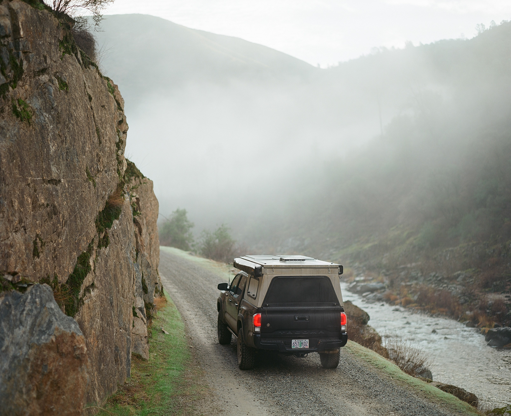

So I decided to sell my digital gear again and I'm back on film. Call me a
hipster, but it's more fun and taking photos is basically the only reason I go
out to pretty places on the truck and bike (also, I'm a hipster). This means
spending less time in front of a computer editing photos. Shoot photos, mail
film to the lab, download photos. Done!

The [Fuji X-T20](https://en.wikipedia.org/wiki/Fujifilm_X-T20) has been
replaced with the 6-pound [Pentax
67](https://en.wikipedia.org/wiki/Pentax_6%C3%977) and the featherweight [Leica
M6 TTL](https://en.wikipedia.org/wiki/Leica_M6). These cameras are about the
same age (~25 years) and they look similar because they both have round glass
things attached to them, but they are very different and perfect examples of
why film cameras are so fun. For this trip, I brought the Pentax with [Ektar
100](https://en.wikipedia.org/wiki/Ektar) film.

## No plan but coffee

Baxter and I were solo this weekend and didn't have a game plan. The first,
second, and third stop was coffee. We headed straight East from San Francisco
towards Yosemite. The highway was closed due to "weather", so we knew we
weren't actually going to make it all the way to the park.

Our strategy for trips like this is to open [Gaia
GPS](https://www.gaiagps.com), enable the [public land
overlay](https://help.gaiagps.com/hc/en-us/articles/115003524607-Public-Lands-Overlay-Legend),
and drive towards big chunks of BLM or state land. This usually means heading
in the direction of Nevada or Oregon to find the good stuff. We start caching
maps on the way because T-Mobile won't exist where we're going.

## The turnoff

We got to the spot the highway closed and started to head South towards the BLM
land. We found ourselves on a large gravel road that kept crossing a shallow
river. Criss-crossing this road was a bunch of private (closed) roads, which
was a bummer. There weren't many options for exploration at this point, but we
were heading in the right direction.

We continued South for another 15 miles or so on this gravel/mud road and
eventually ended up at somebody's house, a dead end. We turned around and
started heading back towards the highway almost immediately because they had
some huge dogs that did not want us there. I also imagine this place doesn't
get many visitors and whoever lived here was probably grabbing their gun and/or
bat.

## Alternate route

So obviously we weren't going to just go back to the highway because that would
be lame. Instead we took the drive back North nice and slow and kept our eyes
open for other options. Most of the roads were private, but we found a public
fire road that looked to be heading Southwest-ish and decided to give it a
shot.

We continued for another 30 miles down this gravel road and were rewarded with
the holy/mighty/wonderful thing known as public land. The reason we look for
this stuff is because it makes camping easy. BLM and state land often has
hundreds of places to camp for free and many of them are 'dispersed', meaning
they don't have facilities, ugly signs/fences, or (most of the time) other
people.

## Parking in the road

With around four hours left of daylight, there wasn't any rush to find camp, so
we putted around a bit to get familiar with the area and grab some photos. We
dropped waypoints on some decent camping spots so we had a backup plan in case
this road led nowhere interesting.

We followed the Merced River, just outside Yosemite park. I could see on the
map that the road would eventually end, which usually means we'd find a nice
campsite or two. This isn't always the case, but people sure do love setting up
camp at the top of hills or the end of roads.

## Slippery when wet

Just as we started to get bored, there was an opportunity to change things up
and cross to the other side of the river. This bridge was slippery and I almost
fell down a bunch of times while walking around trying to take photos.

Baxter usually barks when I leave him in the truck and start running away with
a camera in my hand, but he was totally chill by this point and just enjoying
the ride. It's funny to see him calibrate every weekend and transition from
"city dog" to "adventure dog". He needs these trips as much as I do I think.

## Finding camp

As expected, we started passing a few different places to setup camp as the
road started to end. Most of them weren't that great, so we kept moving. One of
them was basically a grass parking lot with a fire pit in the middle and the
other was a hike and didn't have good vehicle access.

We followed the road to the end and found a decent spot to spend the night, but
it was more developed than I like. It was an almost perfectly leveled platform
with a little wood border. Large rocks were placed to strategically guide
vehicles away from the beach. It had a metal fire pit, a tree, and a bear box.
We did not put our food in the bear box, but also did not die from a bear
attack.

## "Pop"

I think this was the sixth night in the [Vagabond
Outdoors](https://vagabondoutdoors.com/) camper and the first with only me and
Baxter. He struggled last time getting in/out of the bed because he's not used
to being picked up and lifted 5 feet into the air. He's getting better though
and I had to spend a lot less time trying to convince him that it was a good
idea.

I forgot to eat both breakfast and lunch, so dinner was 9 eggs and 6 pieces of
bacon. Baxter did not skip breakfast and had Baxter food for dinner.

## Back at it

True to our usual camping style, we fell asleep around 7PM and got up at 5AM. I
made myself a cup of coffee and Baxter had another bowl of Baxter food. The
"popper" was packed up and we started heading back towards San Francisco just
as the sun started to rise.

The drive out was familiar, but some fog moved in during the night to keep
things interesting. We made it out fast. Before hitting the highway back to SF,
I pulled over to put some air back in the tires because one of them is leaking
pretty bad. I haven't figured out why, but the leak is slow enough that I just
keep topping off every couple days and ignoring it.

I'm glad we made it out here to explore a bit, but doubt we'll visit this area
again. It was too close to houses and parks to have a lot of options for
exploring. It's the kind of place you visit, then never visit again.

---

If you'd like to get an email the next time I post something, [subscribe
here](/follow/).

