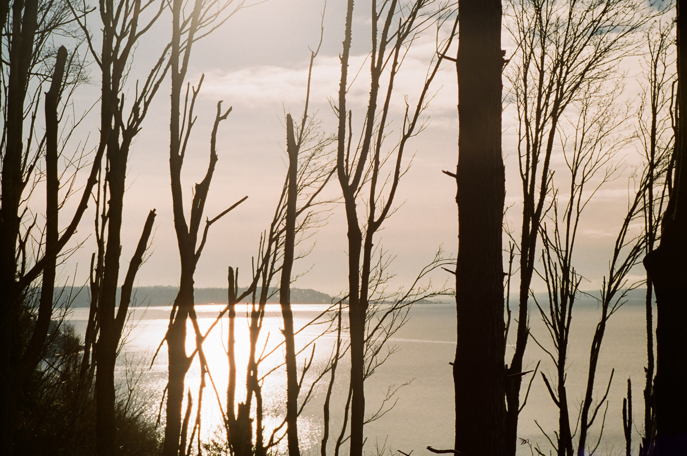
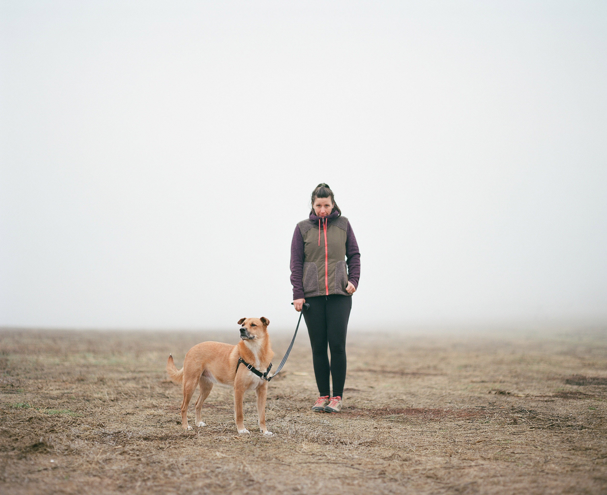

<em>2019-01-30 update: Baxter has been found! Thanks for your help in finding
him. Read the post here: [SF, Maupin, OR](/sf-maupin-or)</em>

Since we decided to go on a [trip around Death Valley](/sf-trona-dv/) for
Thanksgiving instead of visiting family, so we were long overdue for a visit up
North to the "motherland". We had two weeks off and the plan was to take a
couple days to drive from SF to Seattle, spend a few days up there with family,
then take the rest of the time moseying our way back home through some
undecided route that probably hit Oregon, Idaho, and Nevada. This was the plan
anyway - it didn't go as planned.

After starting the trip later in the morning than expected, we made our first
stop just as we entered Oregon at Burma Pond about an hour or so off Interstate
5 near Grants Pass. It's a free dispersed campsite and has a bit of hiking that
we hit up the next morning.

Temps at night were just above freezing and it was a couple days before
Christmas, so we didn't see or hear anyone else out there. There was a vault
toilet and trash around the corner. I didn't take any photos of those because
they're ugly and I like to pretend I don't need toilets, water, or trash cans.

We arrived at camp early in the afternoon around 4PM, but it was already
completely dark when we got to the campsite. On the approach we saw something
that looked like a small controlled burn and someone had covered it in dirt (to
extinguish it), but it was still smoking heavily. Louisa poured a bunch of our
water on the smoke and probably saved the entire forest from burning while we
slept.

We fell asleep at 7PM and didn't see daylight again until 8AM. 16 hours of
darkness was a theme of the trip.

## Grants Pass to Seattle

After waiting around in the sleeping bags for the sun to finally reappear, we
got out of the truck and explored the pond. We grabbed some photos, thought
about making coffee, and hit the gravel road back to Interstate 5 for the last
450 miles to Seattle.

This was one of the first times we've camped since starting the [intermittent
fasting](https://en.wikipedia.org/wiki/Intermittent_fasting) thing and it sure
makes mornings fast. We wake up, squash the camper, and first meal of the day
is lunch.

## Food, wine, and selfies

The Seattle Christmas Tour started at Louisa's parent's house. We ate lots of
food, talked about stuff, and slept in a real bed. We then migrated over to my
mom's house and did those same things again, but we talked about different
stuff and ate different food. It was good to see family and Seattle again. It
had been a while.

The little [Japanese Chin](https://en.wikipedia.org/wiki/Japanese_Chin) is
Daisy and she lives with my mom. What she lacks in weight, she makes up for in
fur and positive attitude.

Louisa's mom is really into hiking, so we broke things up a bit with a hike
through [Discovery
Park](https://www.seattle.gov/parks/find/parks/discovery-park). We lived in
Seattle before moving to Portland (and San Francisco) and Louisa says we've
been there before, but I was surprised how large the park was and don't
remember any of it. We walked around for almost 5 miles.

I have a bunch of photos of the back of Louisa's head and Baxter's butt from
this hike, but tried to get in front a few times for something more
interesting. Louisa is in the green coat, her mom is in the blue coat, and
Baxter is in the tan coat.

Discovery Park runs along the [Puget
Sound](https://en.wikipedia.org/wiki/Puget_Sound) and many of the trails lead
down to the water. There's a lighthouse down there as well.

## Seattle to Lake Chelan

After four days in Seattle with the family, it was time to start the adventure
home. First stop was straight East to Lake Chelan to visit a good friend,
Alisa, who also happens to be the wine club manager at local winery [Karma
Vineyards](https://goodkarmawines.com/).

We grabbed some brunch in town at [Blueberry Hills
Farm](http://wildaboutberries.com/) and bought a bottle of wine for camp. We
weren't really sure where we were going to spend the night yet, but [the
map](https://www.allstays.com/apps/camprv.htm) showed a few spots near Lake
Chelan that we should be able to camp for free.

This truck is new-ish to us and we picked it up just before moving to
California. This was our first time driving in snow, but what a blast! There
are better trucks out there, but this feels like it can do anything sometimes.
Most of the camping in the area was 2-3k higher in elevation, so we started
finding deeper/fresher stuff just minutes after leaving the vineyard on our way
to camp.

To keep with the theme of the trip, we arrived at camp just before dinner and
just as the sun started to set. Just below is Lake Chelan, but you wouldn't
know it because of the fog.

## First night in snow

Not only was this the first time we drove this truck in snow, it was also the
first time we got to camp in snow in the [Vagabond
Camper](https://vagabondoutdoors.com). It was cold. We woke up with an insane
amount of moisture in the tent, under the bed, and on our bags and we thought
there may be some kind of leak from the snow and rain. We decided that it was
just condensation, but this is a problem we need to figure out how to solve
because it was a lot of moisture.

Temperatures hit around 22F that night, according the weather app we were
using. We thought it would be fun to get a thermometer for the sleeping area so
we could see the actual temperature. It doesn't really matter I guess, but it
would be nice to know when you feel cold that it's actually really freaken cold
and not just your imagination.

With the short days and long nights, we also noticed that we spent much more
time in the camper than expected. I've always thought of it as a place to sleep
and not a place to "hang out", but when the sun sets so early and you've
already eaten dinner, 6PM feels like bedtime. We tossed around the idea of
getting a heater, but something tells me that would make the condensation
problem even worse.

## Let's camp somewhere warmer

So after our first night in the snow, we woke up immediately thinking that it
would be nice to try somewhere warmer the next night. We decided to start
driving Southeast towards Eastern Oregon, but it never really got any warmer.
It actually got colder.

Since the sun decided to set at lunch time, we again arrived at camp in almost
complete darkness. I'm thankful that
[Brian](https://www.instagram.com/danneskjold01/) installed lights on the
camper because they have been super useful. Camping in the darkness has always
been a pain, but good lights that you can leave on all evening make it easy to
cook and see what you're doing.

Louisa put her fire building skills to the test and got something burning in
the snow. We used those little mini fire starter logs you can pickup at Safeway
for a buck or two to get it going. The fire didn't provide much heat, but it
was pretty to look at and felt like an accomplishment since the weather was
trying its best to put it out. We camped in the Southeast corner of Washington,
an hour below Pomeroy.

As snow collected on the branches of the massive trees, some of them started to
fall. We woke up a couple times to the sound of the camper being hammered with
giant snowballs. In events like this, a reasonable person might be concerned
that the weight of giant snowballs (or branches) could crush the camper like a
panini, but the Vagabond has an additional support pole on the inside that can
be used to prevent this from happening. We did not use that support pole, but
probably should have.

## No really, warmer please

The next morning we were even more convinced we wanted to try somewhere warmer
and were more strategic with the driving. Two nights in the snow was good
enough for now. We cut back Southwest into the desert of central Oregon where
temps were just above freezing. I've been in this area a lot on the motorcycle
and like how remote and empty it feels.

We drove more miles this day than we usually like to do on a longer trip, but
that just meant we got to visit more of those cool Easter Oregon gas stations.
Thanks to a new law, we could even pump our own gas.

We stopped a few times on the Washington/Oregon border to stretch the legs.
Most the parks were designated Native American fishing/hunting areas, which
means not a lot of public access, but there was still plenty to see.

## Stoppin' in Maupin

We spent the night a couple hours North of Bend in Maupin, Oregon. There's a
BLM road that runs a few miles South of town along the Deschutes River and it's
littered with camping. Temps were great and no snow. Louisa got a camp fire
going again while I cooked dinner. We had bacon, eggs, and potatoes. Baxter ate
a stick.

The fire was so good that we managed to stay up past 7PM and had a couple
glasses of wine. We finished the evening with a movie in bed and slept for 12
hours. The large river provided a loud, but soothing, white noise.

## Then we lost the dog

The next morning is when the mood of the trip changed from awesome to horrible.
We waited in our sleeping bags for the sun to start rising, then jumped out of
the truck to get ready to hit the road. I grabbed my toothbrush and Louisa
grabbed the dog for a quick walk. While brushing my teeth, I wandered over in
Louisa's direction just as Baxter darted off in the bushes after something -
and that's the last time we saw him. Was it an animal? Was he heading for the
river? No idea. As of writing this, we still haven't seen him.

The next 9 hours of daylight are a bit of a blur, but it involved Louisa and I
zig-zagging back and forth across every bit of BLM land we could reach with our
feet, yelling Baxter's name, and looking inside every bush and hole. No
response. Then we did it again, and again, and again. No response.

A truck drove past the campsite and Louisa flagged them down for help. They
were some local hunters and they had their dog with them as well. They let
their dog wander around a bit to help look for Baxter, but we couldn't find
him.

The sun set, it got dark, and we setup camp for the night at the exact same
spot hoping he'd find us in the night. Unfortunately, he did not.

The next morning, we started the day by again exploring the BLM land around our
campsite inch by inch and yelling his name. No response. We decided to hop in
the truck and drive further down the BLM road, yelling his name from the
window. We reached the end of the road. No response. We turned around and tried
again, and again, and again, and drove the length of the road until the sun
started to go down. Still no signs of Baxter.

The next step for us was to try and get some help. Baxter was wearing his tags
when he disappeared and we thought/hoped that maybe he got picked up by someone
and we'd have a voicemail waiting on our phones. We did not have any cell
service and did not want to leave the area (yet), so Louisa gave me her phone
and stayed at camp while I drove up past town looking for cell service on both
our phones. Baxter's tags have both my number and Louisa's number.

I found cell service, but no voicemail and no data connection. We made one more
trip up/down the BLM road with fingers crossed (still no Baxter), then decided
it was time to find some wifi. We left some smelly clothes at camp in hopes
that maybe Baxter would smell them and stay a while if he came back in our
absence. We left and drove to Bend.

Once in Bend, we setup office at [Spoken Moto](https://spokenmoto.com/) and
shared on social media that Baxter had been lost. We used Google Maps to call
every business in Maupin to ask that they keep their eyes open for him. There
are many boating, fishing, and tour companies in the area that go down the
river everyday. We emailed photos and messaged folks on Instagram/Facebook. We
updated Baxter's information for his chip. We called the moms at home and they
helped as well (thanks moms!)

We returned to Maupin that afternoon to check the campground again, still no
Baxter. We explored on foot again, then went up and down the BLM road again,
then stopped every car on the road (again) and asked them to please keep an eye
open for Baxter. We had done this loop so much by this point that we had a
process in place and knew how many times we could do it before the sun went
down.

The next day we printed up a bunch of 'lost dog' posters at the photo printing
kiosk in the [Maupin Market](http://maupinmarket.com/). It was actually a
pretty cool machine. You could put in a CD, a USB stick, or plug in your phone,
and photos could be printed at many different sizes right there on the machine.
We printed out the picture we posted to Instagram and it looked pretty good. If
we weren't trying to find a lost dog, we may have stayed there a while and
printed a bunch of other things as well.

Everyone in town was super friendly and helpful and we had the poster in just
about every window and door. Many of the folks we visited knew Baxter was
missing before we even got there because people were posting on local Facebook
groups and spreading the word. Thanks everyone!

We spent New Years Eve at The Rainbow Tavern in town. Louisa had a tragically
large plate of nachos and I had a bacon cheeseburger. We slept at the hotel
next door for wifi. The next morning we drove back to the campsite and up/down
the BLM road one more time, then started the sad drive home to SF without the
dog.

And that was the end of the trip. We still haven't seen Baxter and are still
hoping he re-appears someday and folks give us a call. As of writing this, it's
been two weeks. We made our way back to San Francisco and it was probably the
quietest drive ever. No podcasts and no music and not really a ton of talking
other than the occasional comment about the strangeness of the situation.

We've known Baxter for 8 years and so much of our life is structured around his
presence that, to have him suddenly disappear, it's quite shocking and we are
reminded of his absence with almost everything we do.

We're hoping to have an update on him sometime in the future, but until then,
are staying positive and continuing to camp like crazy (although with one less
hot body in the camper.) If you see him, give us a call please. :)

<em>2019-01-30 update: Baxter has been found! Thanks for your help in finding
him. Read the post here: [SF, Maupin, OR](/sf-maupin-or)</em>

---

Thanks for reading. If you'd like to get an email the next time I post
something, [subscribe here](/follow/).

