

About a month ago we [lost our dog](/ca-xmas-or) Baxter on a camping trip in
Maupin, Oregon. It sucked. We looked as best we could while we were there and
finally decided to plaster 'lost dog' posters everywhere, share on social
media, and head back home to San Francisco without the dog. Temperatures were
well below freezing and everyone warned us about mountain lions and angry
badgers. We didn't expect to ever see Baxter again.

But *(spoiler alert)* we were wrong...

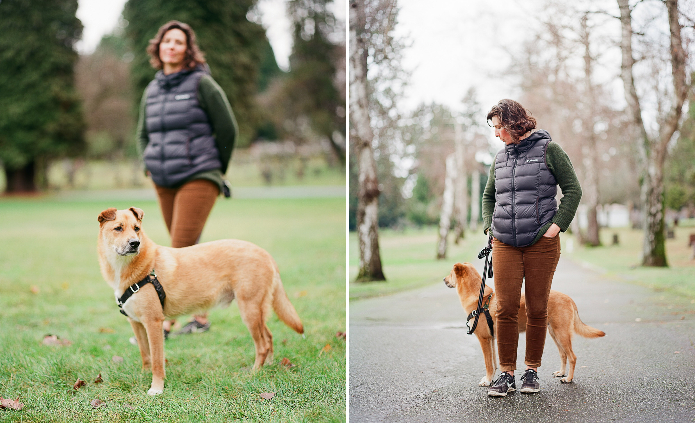

## Tornado dog

Here's a bit of history about Baxter. He was born in the midwest in 2011
without a home. He didn't have a home because everything around him was
destroyed in one of the most active and [deadly series of
tornadoes](https://en.wikipedia.org/wiki/Tornadoes_of_2011) on record. More
people died that year than the previous 10 years combined. Baxter was born in
the middle of this mess and survived two EF5 tornadoes before he was 6 months
old.

We first met Baxter a few weeks later when he was scooped up and flown to a
clinic in Seattle, Washington (along with a bunch of other wondering dogs).
This is where we adopted him 8 years ago and named him Baxter. We've had him
since and have moved from Seattle to SF to Portland and now back to SF.

We always tell this story about Baxter because it makes him sounds like a
badass. He's a survivor. In reality, however, we call him "Couch Dog" and
secretly think that he wouldn't do that well if tossed into a tornado today.
We were wrong!

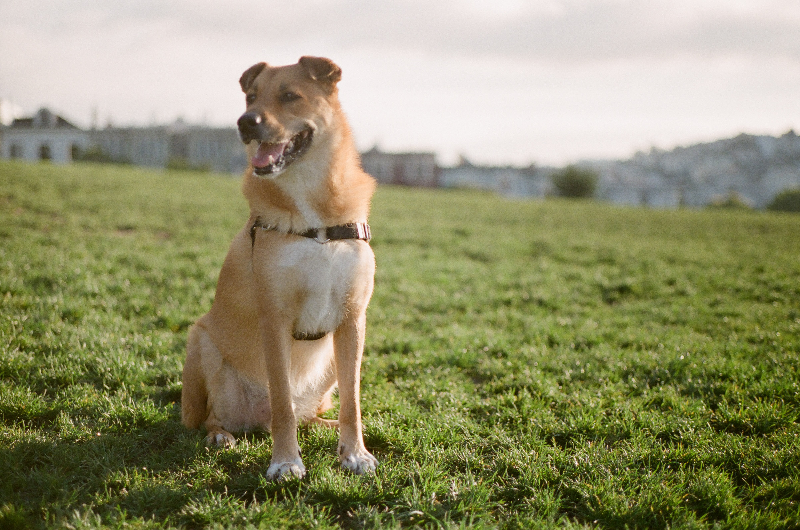

## The first sign of hope

Baxter has been lost for almost a month, but a bit over a week ago (Friday
1/18), I was at work in the city and got a call on my cell from a number I
didn't recognize. The area code was Bend Oregon so I answered hoping it was
someone calling about Baxter... and it was.

The person on the phone, who I later learned was Grayson, told me that he lives
and works on private/gated land just South of where we lost Baxter. He said
that he's pretty sure he saw him twice, but couldn't get close enough to take a
photo. The dog was scared and growled anytime he approached.

I took down Grayson's information, called Louisa, and we got in the truck
immediately to head back to Maupin. We both had a 3-day weekend, so the timing
was perfect. The truck was even packed already because we were planning to camp
on the coast that weekend anyway.

We were able to make it to Maupin by 1:30PM the next day, but we had to spend
the night in a Walmart parking lot near Redding to make that happen. I did not
take a photo of the Walmart parking lot because I do not want to remember it, but
here's a pretty photo of where we camped the next night:

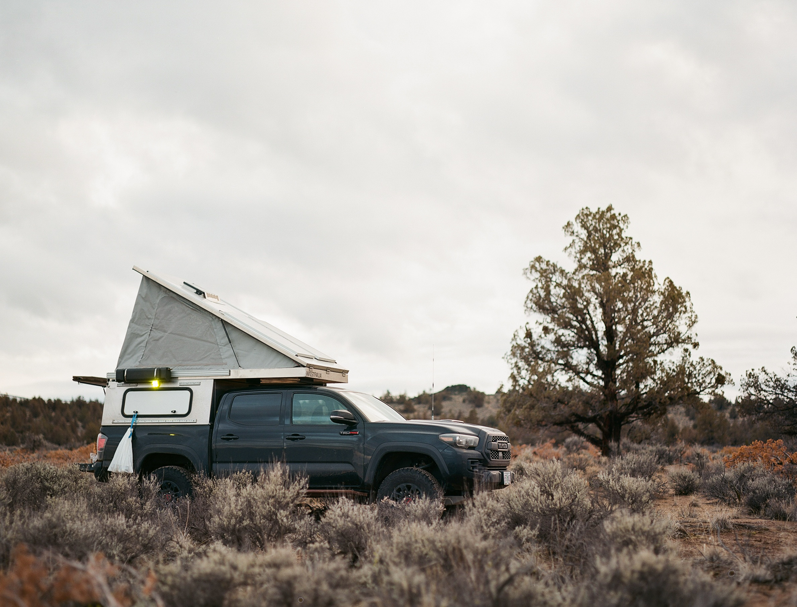

## North Junction eh?

There's no cell service in the area, so we called Grayson's home phone as we
approached Maupin and setup a time to meet at the locked gate just South of
where we lost Baxter. We didn't sleep too well the night before - we were so
stoked on the possibility of finding the dog.

We rolled up to the gate a bit early, but Grayson was already waiting for us in
his truck. He was early the next day as well, but let's not get ahead of
ourselves.

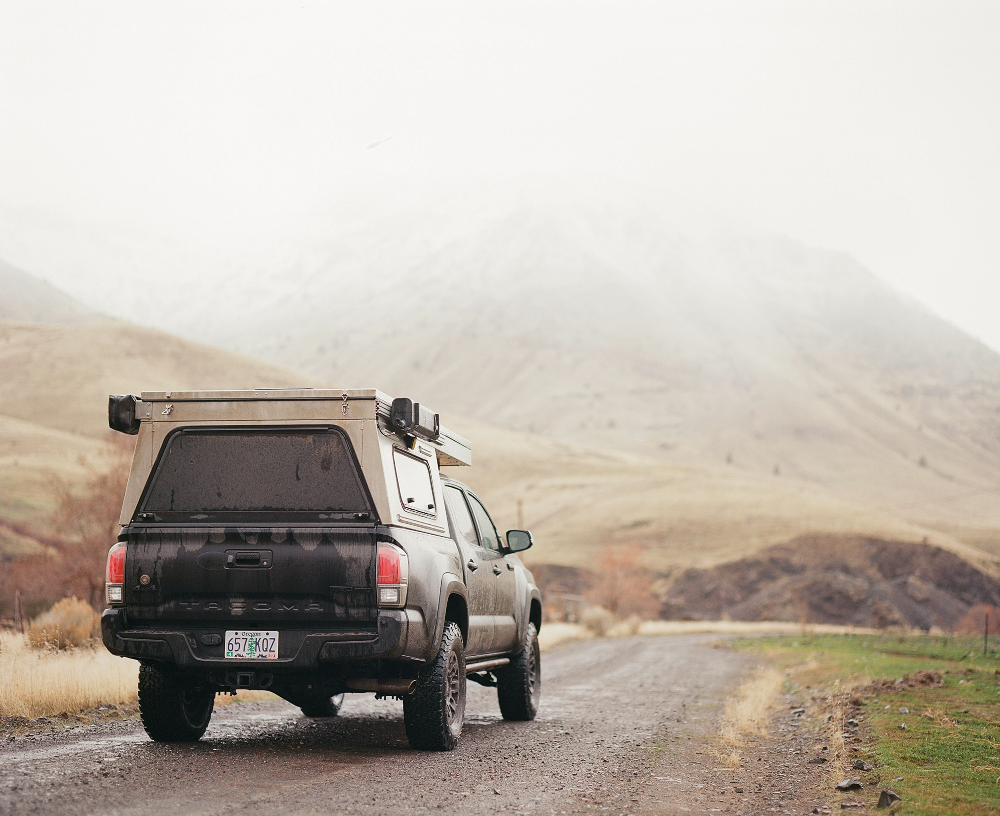

Beyond this locked gate, the road continues for about another 45 minutes, then
terminates at a railroad track and a bridge. There's a very small "town" called
North Junction just below this bridge. This town is an old paymaster station
and is littered beautifully with old railroad equipment and railroad cars. I
use the term "town" loosely here because it's actually a collection of about
5-7 houses and nobody actually lives there.

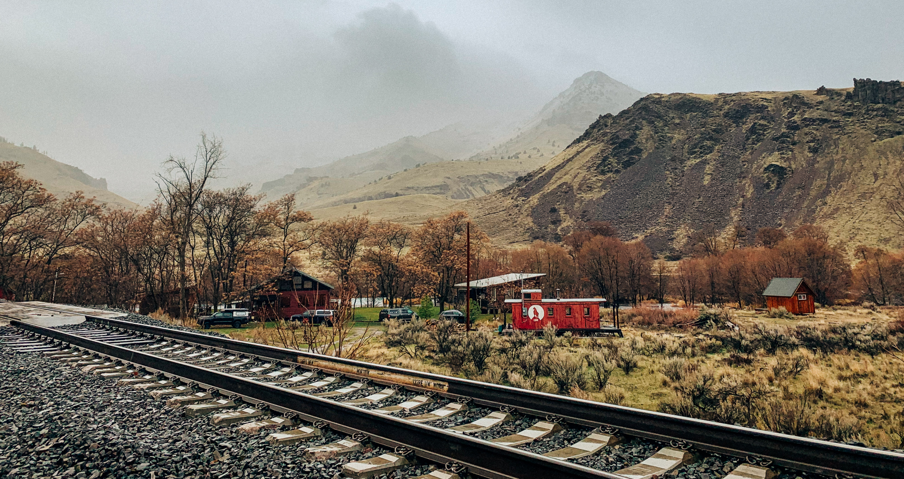

This little neighborhood has no stores. There's no driveways. You're not going
to get mail here. It's as if someone flew over the middle of nowhere in a cargo
airplane and dropped some random houses from all over the United States onto
this piece of land, then sprinkled some super cool looking railroad equipment
between the houses. The nearest grocery store is Maupin, which is at least 90
minutes if you're not rushing. All that said, we *loved* it here and wouldn't
mind visiting again!

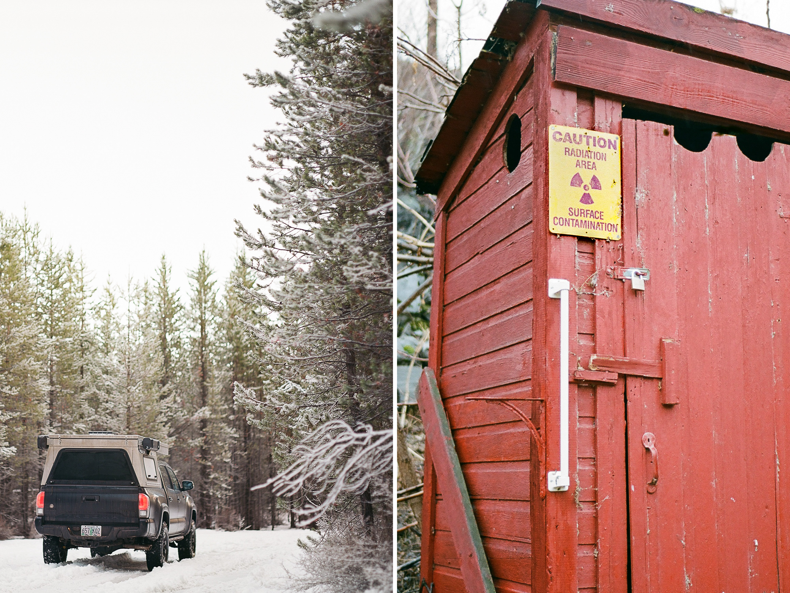

Now, Grayson doesn't live at North Junction, but he's very familiar with the
area. He's the caretaker for this private road and the only person that lives
behind the locked gate full-time (him, his wife, and dogs). He drives the
entire length of the road multiple times every day to clean up rocks, check on
the houses, look for lost campers/rafters, and generally just keep his eyes
open for stuff (like a lost dog named Baxter, for example).

Grayson called us because he had seen Baxter Friday morning at a house along
the road. He left some food just in case the dog decided to come back. He then
drove down past that house to North Junction because he suspected that Baxter
might be heading down that way. The dog appeared to be following the road
South.

Nobody really lives at North Junction, but a couple from Portland was staying
down there for the weekend and Grayson asked them to keep their eyes open. He
carried a copy of the "lost dog" flier in his truck so he could show it to
people.

That night the couple spotted Baxter at North Junction. Things were looking
good.

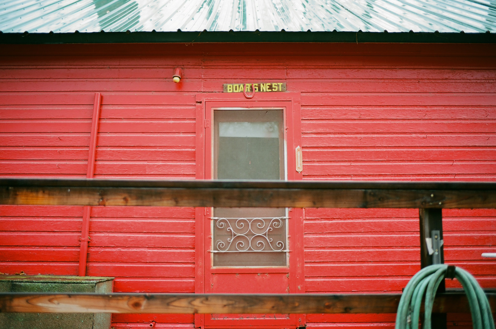

So - back to our story. We arrived at the locked gate Saturday around lunch and
Grayson led us immediately to North Junction because he was spotted there the
night before. It was raining heavily, so we had to stop a couple times to move
rocks out of the road. It took us around an hour to drive the length of the
road and we passed through a couple neat looking tunnels.

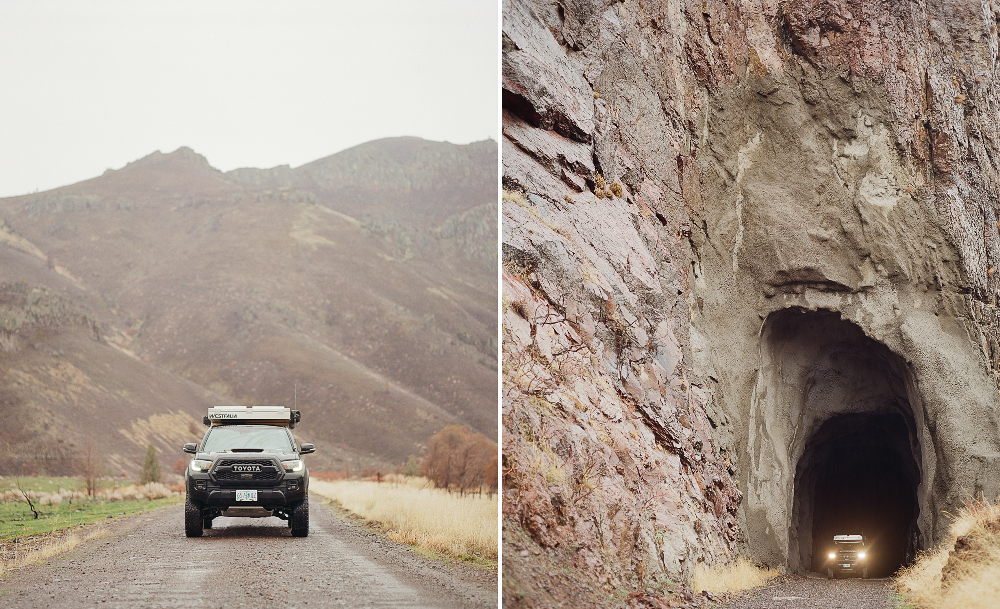

When we reached North Junction, I guess Louisa and I were hoping that we would
get out of the truck and Baxter would just come running towards us (barking and
squeaking as he normally does). This isn't what happened unfortunately.
Instead, we arrived at North Junction and saw nothing. We yelled Baxter's name.
We checked under every porch and house. We walked the railroad tracks. We
looked for footprints or poop. We saw nothing.

Grayson was there with us the entire time helping us look. He seemed to be
going really out of his way and we can't thank him enough. You're amazing
Grayson! We couldn't find Baxter at North Junction and the sun was starting to
set, so we headed back towards the locked gate in the trucks and stopped at
every house along the way to see if Baxter might have backtracked.

We didn't find Baxter that day, but Grayson offered to meet us the next morning
at the gate so we could try again. We said our goodbyes, drove a few minutes
down the road, setup camp, got some sleep, and woke up the next morning to
resume the search.

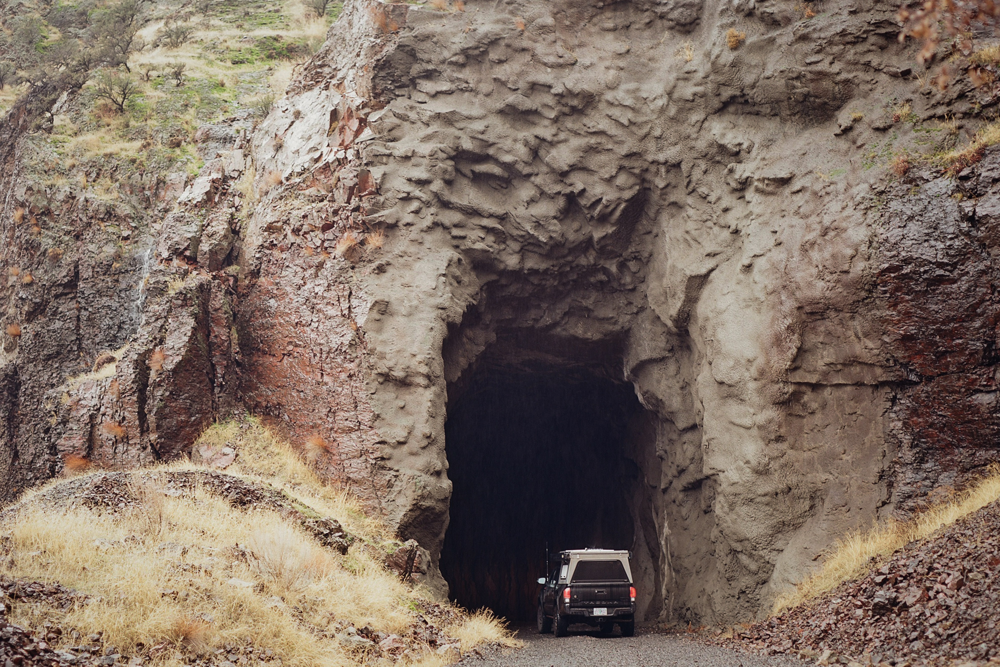

## Let's try again tomorrow

We slept a bit better that night (or at least I did). The morning was quick. Up
at 7, then a short drive to the locked gate, then coffee while waiting for
Grayson. He got there a bit early again and led us through the gate.

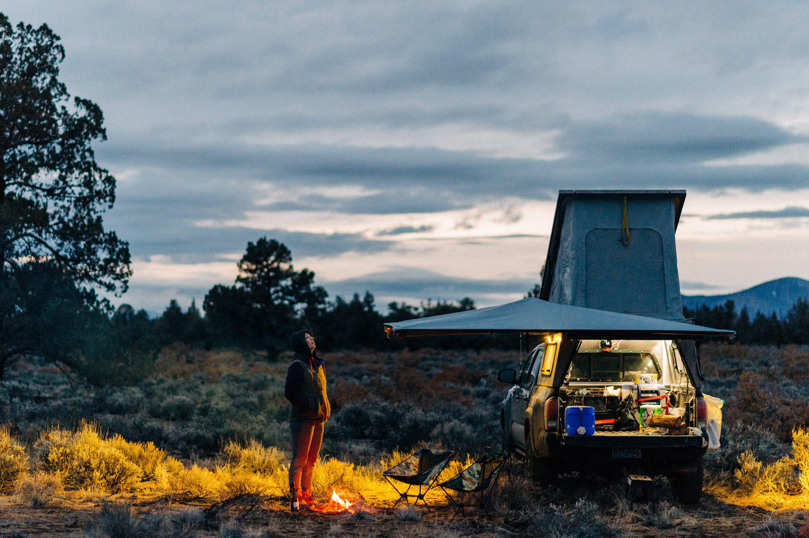

This day was much like the day before it. We headed directly to North Junction
at the end of the road, cleared rocks along the way, and started our search for
Baxter. Most of our searching was on foot because there's just this one road
that passes through the area. We again searched under all the houses and
porches.  We searched near the water. We walked down the railroad tracks even
further.  We called his name and yelled some of his favorite words (... like
"treats").

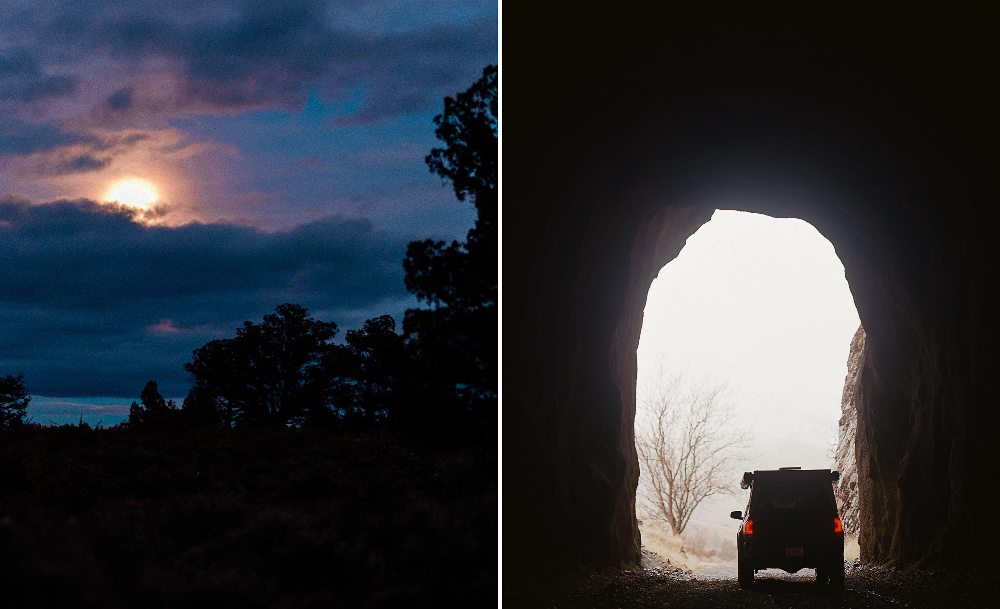

We finished another day behind the gate without finding the dog, but ended up
making a good friendship with Grayson and his wife. They are some seriously
nice people and spent their whole weekend helping us out. Grayson even gave us
a big bag of [La Croix](https://www.lacroixwater.com/) for our drive home and
said he'd call again when he saw Baxter. He had some ideas on how he may be
able to catch him.

## Lost him again

The drive back home from Maupin was a sad one, similar to when we left the
first time. We both tried not to get our hopes up, but when Bax was spotted
twice in the same day just a few hours before we arrived, it's tough to ignore.

If nothing else, it was amazing to hear that he was still out there walking
around and doing his own thing. It had been 21 days at that point since we lost
him and we figured he was long gone by now. This was the first time we got a
phone call. He was finding ways to eat, drink, stay warm, and avoid the giant
cats and angry badgers.

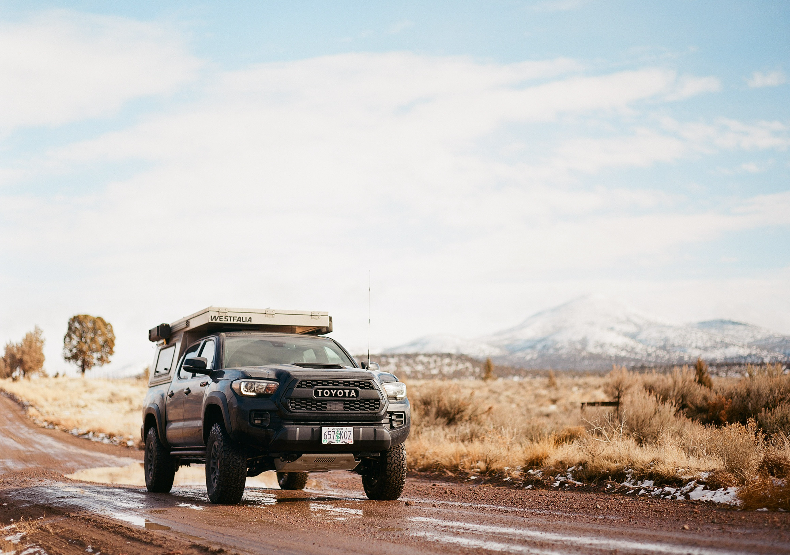

## 'Blood Moon' in Bend

The drive back to SF takes two days. We know this now because we've done it so
many times. We decided to head two hours South to Bend, then stop for the
night.  Going further wasn't a great idea for us because it would just keep
getting colder and colder, which isn't ideal for camping.

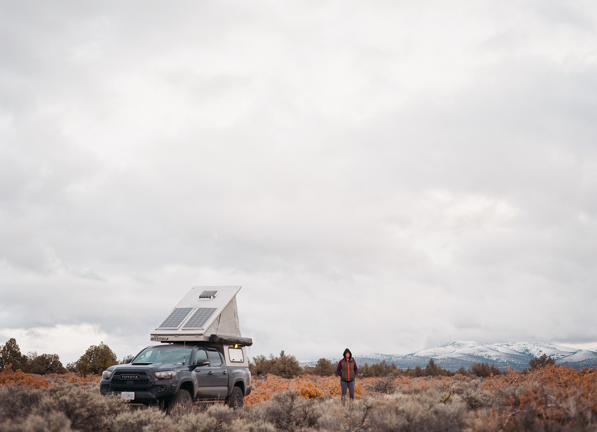

We drove 20 minutes East of Bend towards Four Corners and parked in a secluded
spot to camp. It was close to several OHV areas, so we could hear bikes ripping
in the distance. Louisa got the camp fire going and I got the dinner going.
Louisa also got the wine going.

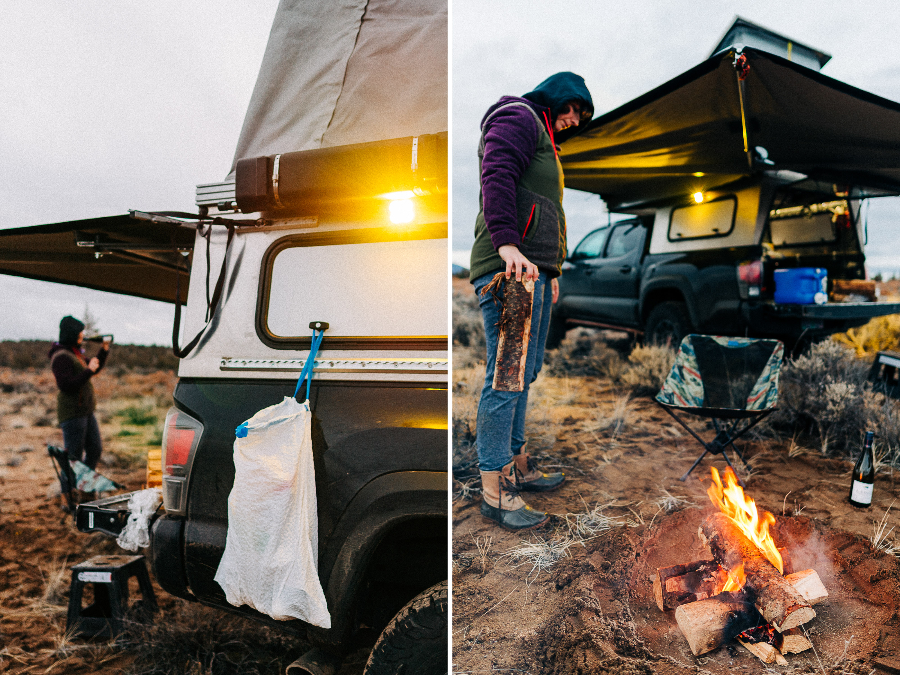

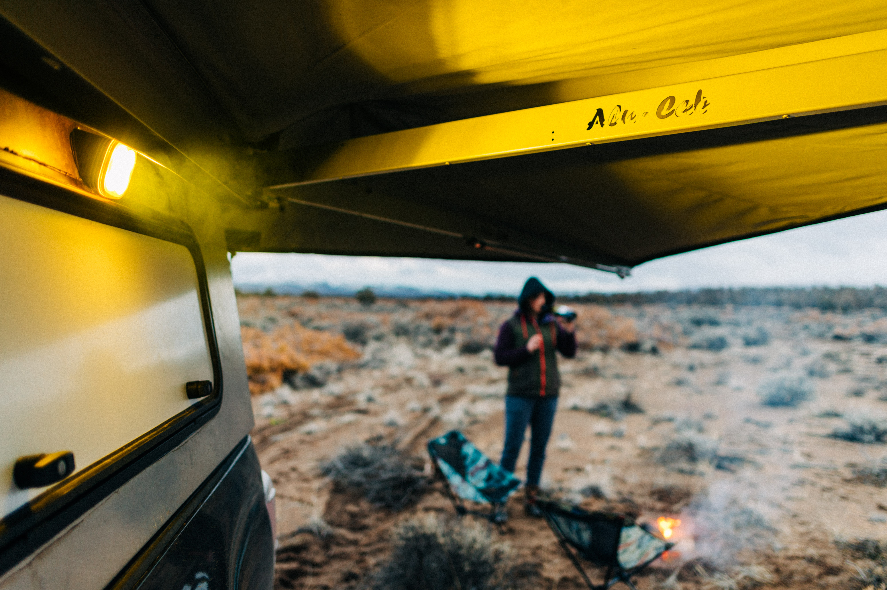

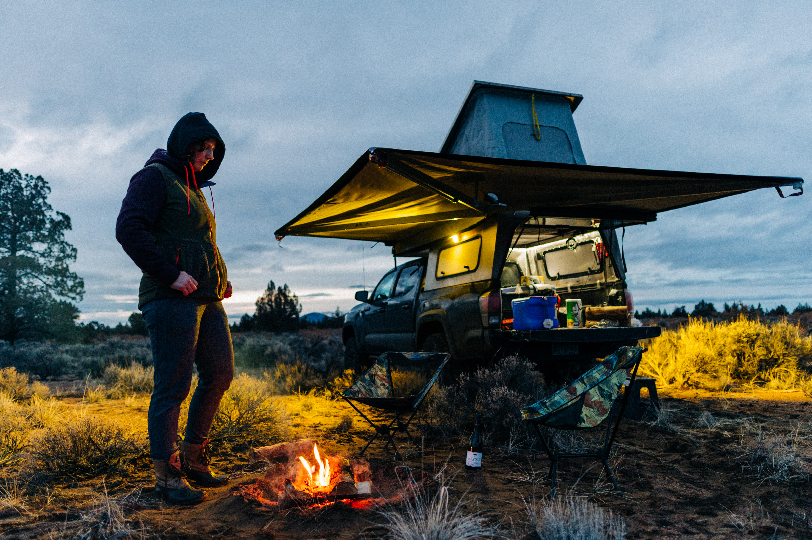

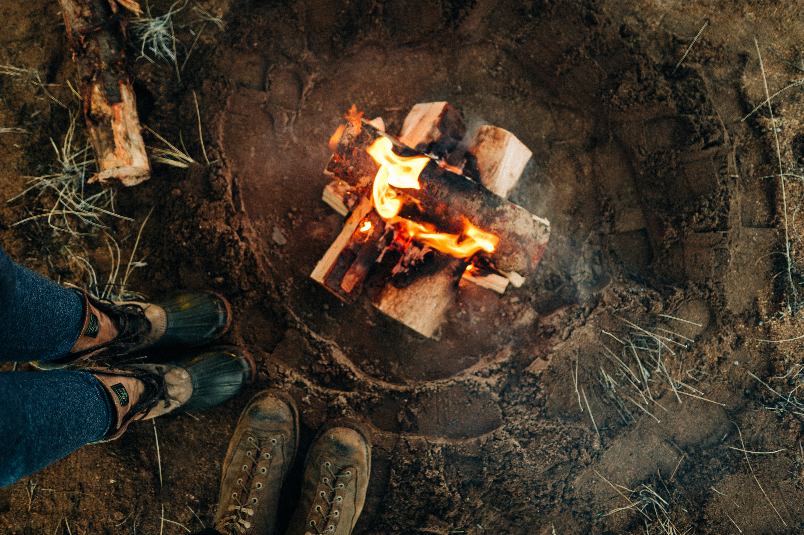

As the sun went down, the moon came up and it was *huge* and *red*. It turns
out we were watching a [lunar
eclipse](https://en.wikipedia.org/wiki/Lunar_eclipse) and had pretty good
seats. Louisa was already aware that this was going to happen because she reads
the news, but I avoid all news and had no idea what was going on. The internet
calls this the **#bloodmoon**.

After nature's light show, we went to bed and watched a movie. We stopped
watching before it ended because we were tired from walking around all day and
yelling. The next morning we packed up camp around 5:30 and drove the 500 miles
back to San Francisco.

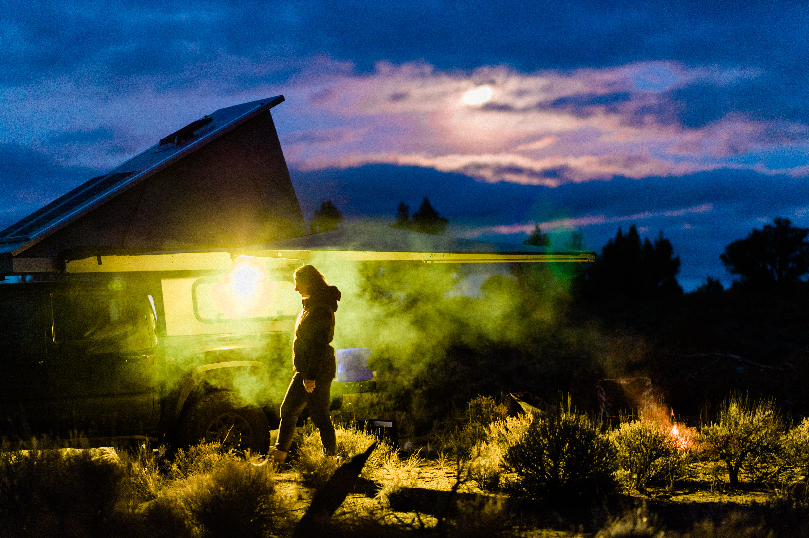

## The very next day

So now Louisa and I are back at work making that money and *ring ring* my phone
starts buzzing again. We just got back home last night; is this for real? The
number isn't one I've seen before. It's not Grayson. The area code is not Bend.
It's somewhere else in Oregon.

I answer the phone and it disconnects - nobody there. I'm on my way out anyway,
so I ignore it for now and leave the building to start my walk home. Just as I
get outside, it rings again and this time someone is on the phone. His name is
Jeremy and he's an animal trapper in Maupin. He catches coyotes. He said he
caught a dog named Baxter.

As I walk home through China Town in SF, I'm listening to Jeremy tell me the
story of how he found this dog. I just so happen to take photos [as I walk](
https://www.instagram.com/forawalk/) home:

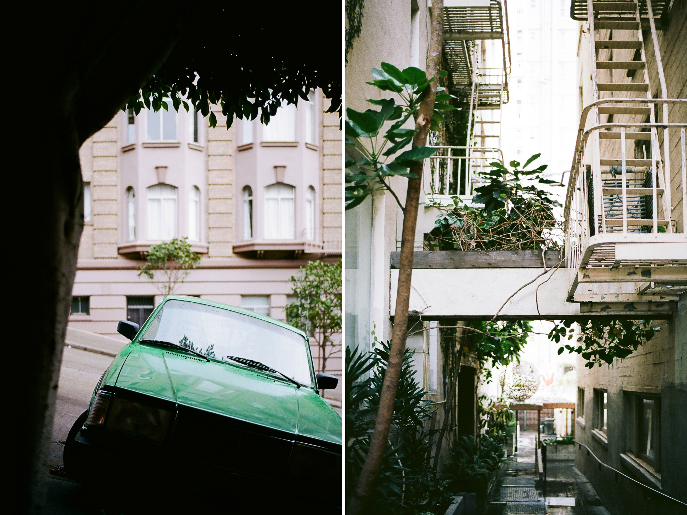

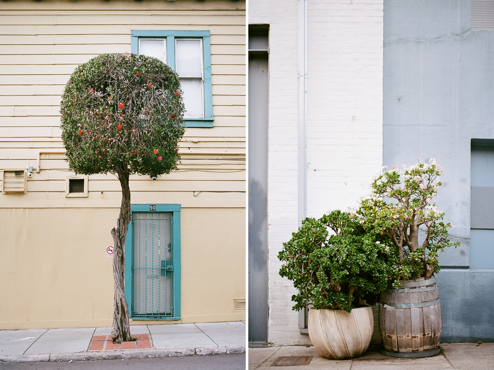

As the story goes, Jeremy's been working on a private ranch about 30 miles East
of where we lost Baxter. This ranch is huge (about 80,000 acres). If you're
driving down highway 97 near Maupin, 27 miles of that highway runs along this
ranch.

Jeremy said that this ranch, and Central Oregon in general, has a bit of a
coyote problem. There are too many of them and they have lice. On top of that,
the state is trying to re-introduce wild birds into the area and the coyotes
keep killing them. The coyotes do have some predators (giant cats mostly), but
there's not enough of them to keep the population down.

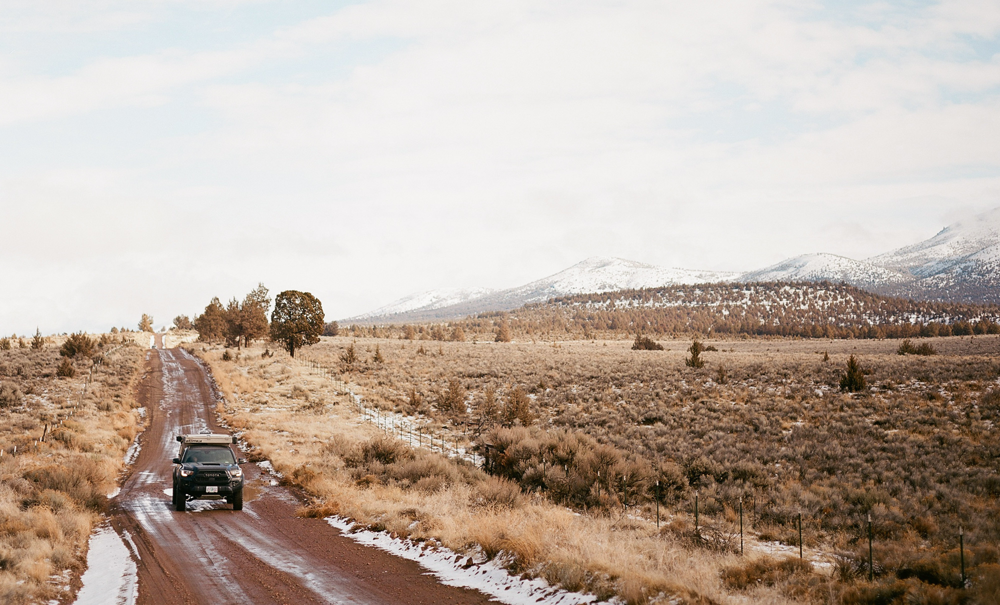

Jeremy has been laying traps on this ranch to catch coyotes and move them
elsewhere. These traps don't really care if you're a coyote, however. They are
also pretty good at catching dogs or anything else with a foot. The traps have
been adjusted so that if a ranch dog steps into one, they won't get severely
injured. It probably feels a bit like slamming your hand in a car door, but no
broken bones or broken skin.

Every day (or every other day) Jeremy drives around the ranch and checks his
traps for animals. Yesterday this trap was empty. Today he rolls up to find a
brown dog standing there.  He doesn't recognize the dog and the dog is scared
(understandably).

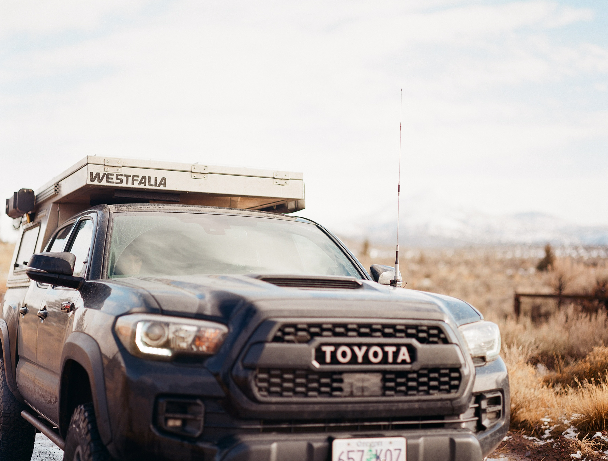

He releases the trap and tries to put the dog in his truck. He can't get a good
hold on the dog because he's not wearing a collar. Jeremy happens to have his
own dogs with him, so he takes off one of their collars and tries to put it on
the dog he found in the trap. The dog is pissed and not interested in wearing a
collar - he just keeps biting it.

The brown dog looks hungry (read: *skinny*), so Jeremy has an idea. He reaches
into the truck and shares some of his homemade jerky. The dog loves it, so he
shares more. Then he shares more. And 30 minutes later Jeremy has shared all of
his jerky. The dog is now his best friend and jumps up into the truck on his
own.

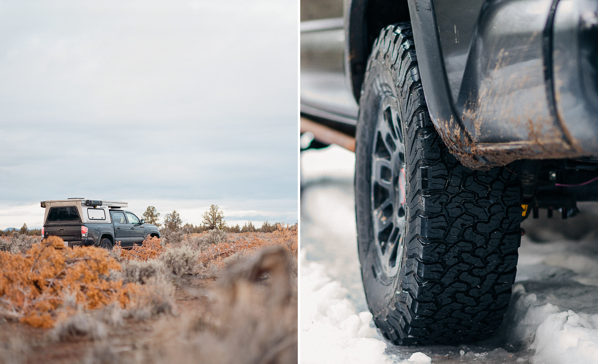

With his new friend now in the truck, Jeremy starts the drive back towards the
ranch manager's house. The ranch manager's name is Craig. It's possible that
maybe this dog is from a neighboring ranch and Craig may know where he lives.
If Craig doesn't know where this dog lives, he probably knows the phone numbers
of the nearby ranches and can start making some calls.

On the way to Craig's house, Jeremy grabs a quick selfie with the dog and posts
it to Facebook. Anyone recognize this dog??

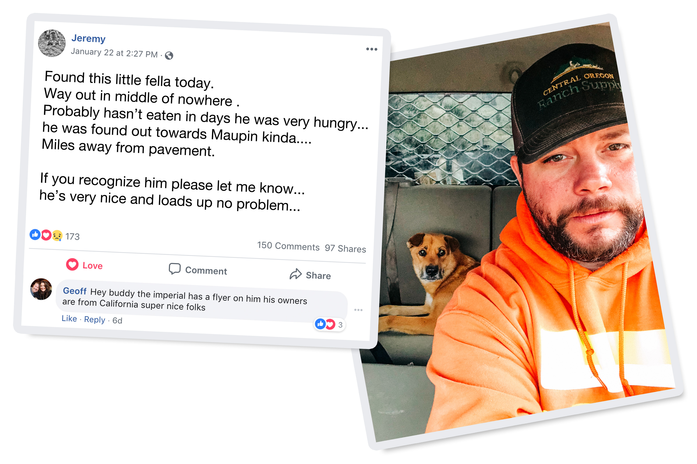

## Hey, we know that dog!

The response to Jeremy's post on Facebook was swift and plentiful. Many people
(who we've never met) identified the dog as Baxter and provided our contact
information. They recognized his face from other posts on social media and from
fliers that were shared around town in Maupin. Jeremy did not see these
messages, however, because cell service isn't that great on the ranch.

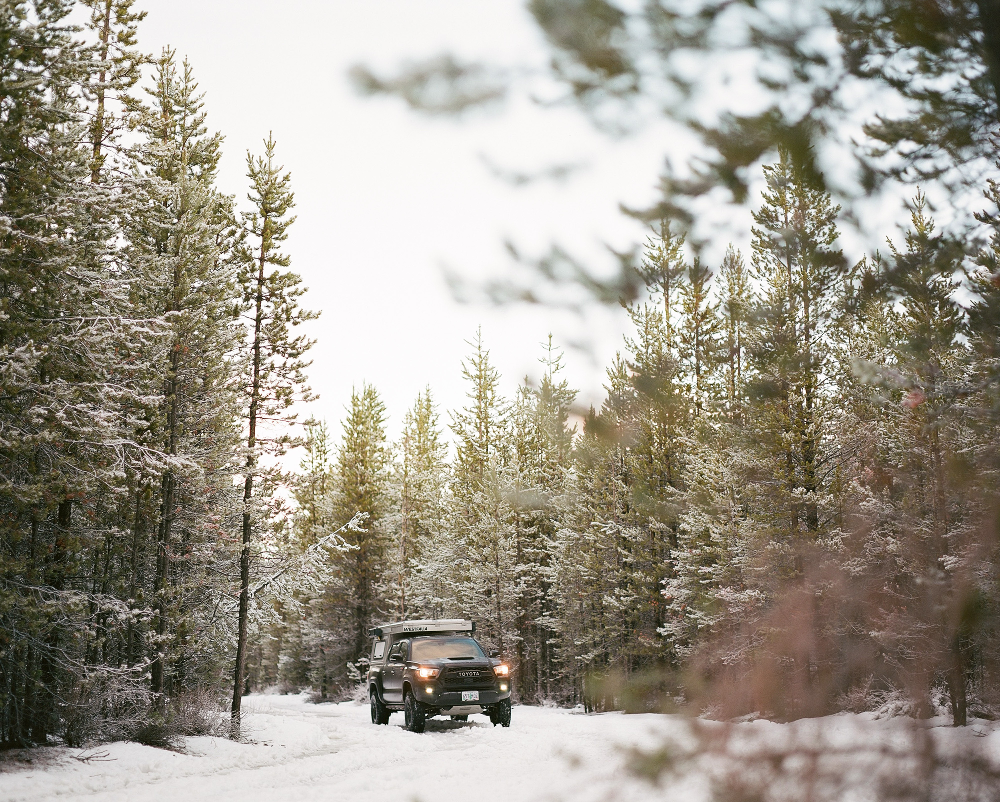

When Jeremy arrived at the ranch manager's house, he left the dog with Craig
and Craig put the dog on a bed on the porch and left to finish up some work
outside on the ranch. The dog's foot was hurting from the trap, so he was happy
to stay put for a while. Also - he just ate a ton of beef jerky so heck ya
he'll stay around!

Jeremy started the drive home and quickly returned to cell service once he left
the ranch. His phone started blowing up. He got a call from a friend who
fosters dogs in the area. She had seen his Facebook post, told Jeremy all about
Baxter, and forwarded our contact information. Jeremy then gave us "the call"
and here we are hearing the story.

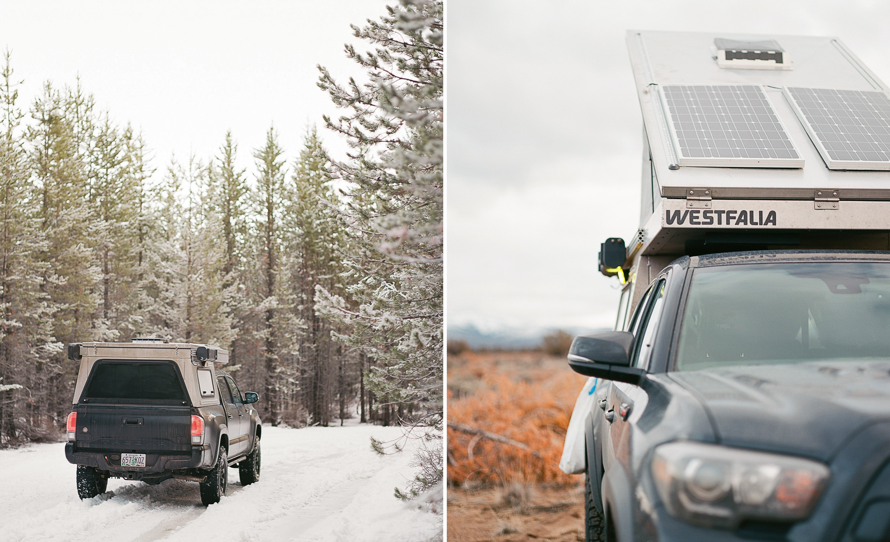

## Here we come Bax

After I got off the phone with Jeremy, I immediately called ranch manager Craig
to setup a time to pickup Baxter. His ranch is just outside Maupin. I told him
I was going to leave right away and could be there as early as tomorrow
(Wednesday) afternoon. We literally just got home from making this drive
yesterday, so I was feeling confident in the timeline.

Craig was very nice on the phone and said the timing was perfect, but there was
one little issue... he didn't know if he still had the dog.

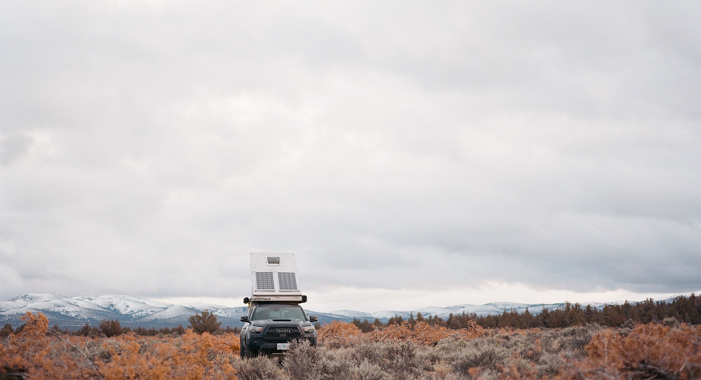

You see, Craig didn't have a place to put the dog and had left him resting on
his porch while doing some errands around the ranch... probably not a big deal
and he was pretty sure he was still there. I mean, no big deal right? In
retrospect, Craig said he would have put the dog in a crate or his house if he
knew the story, but this was just some random dog and he had no idea the dude
was walking around lost without his people for 24 days.

I'm still talking to Craig on the phone at this point and he's about an hour
away from the porch that probably has Baxter on it. He said he'd give me call
when he got home to confirm that he still had him. *This was probably the
longest hour ever :)*

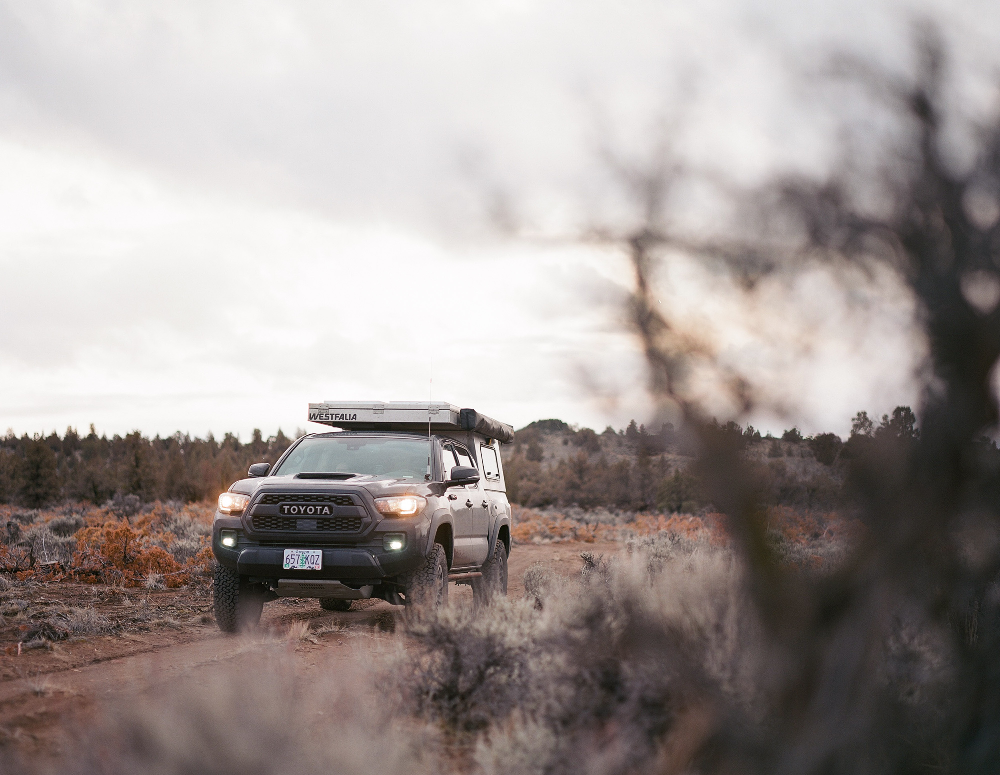

## Third time's a charm

After I got off the phone with Craig, I stopped taking photos of my walk home
and started jogging instead. I packed the truck, made dinner, and danced around
the apartment with Louisa. I talked with folks at work and decided to take the
rest of the week off so I could leave immediately for Maupin. Louisa's job is
slightly less flexible in that regard (she's a high school teacher), so we
decided that I would do this trip solo.

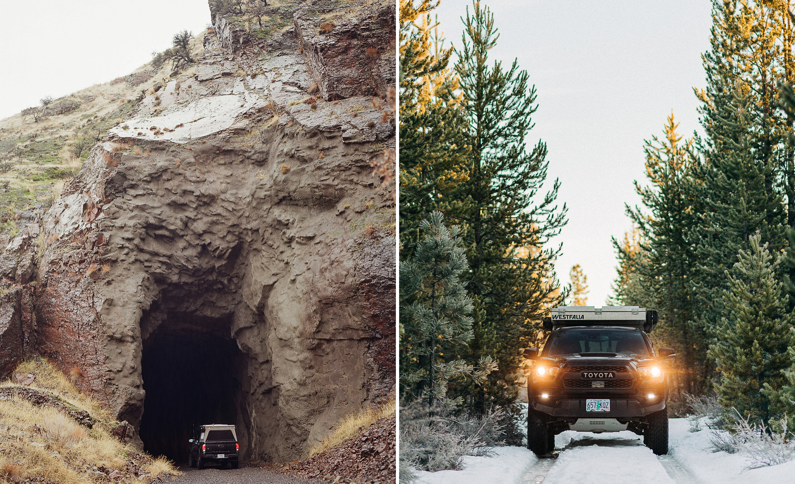

Just as I was about to jump into the horrible San Francisco traffic and start
the drive North, I got the call from Craig. We were expecting this call - it
had been about an hour since we last talked and we wanted to know if he still
had Baxter. Craig said that he just got home and the dog was exactly where he
left him: on a bed on the porch. YAY!

I talked a bit with Craig on the phone about logistics and he recommends that
we give Baxter to his friend Art, who lives in Bend. Art has been working on
the ranch a while and handles their security. Art also happens to leave the
ranch every evening and head home to Bend Oregon. He's got a nice (fenced) yard
for Baxter, a friendly yellow labrador, and he lives 90 minutes closer to San
Francisco than Craig. This sounded like a great idea to me as well.

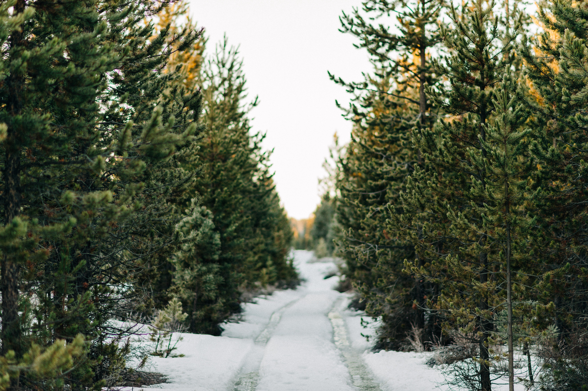

## ETA 11 hours

So Baxter was picked up by Jeremy, delivered to Craig, and just handed off to
Art - who's on his way to Bend. I'm driving from San Francisco and should be
there in about 11 hours. That's not counting my 6 hours of sleep in the Walmart
parking lot near Redding.

My phone rings during the drive and it's Art, the person who now has Baxter.
Just like Jeremy, Craig, and Grayson, Art is extremely nice and seems to be
really going out of his way to help us get Baxter home. He recommended a few
places to stay along the way and let me know that Baxter will be safe until I
get there.

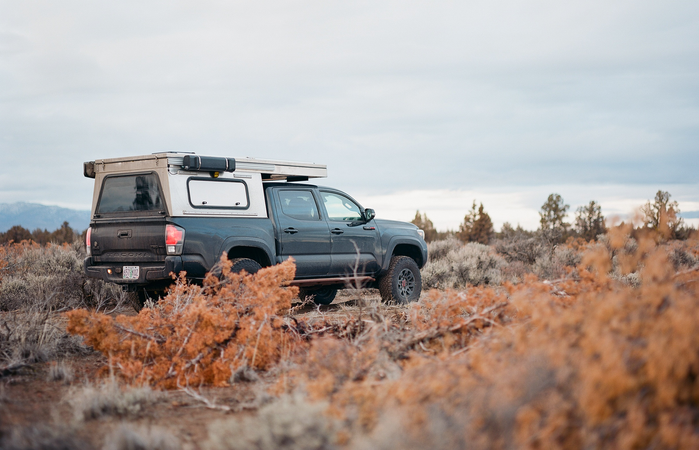

Art tells me on the phone that Baxter has been super nice and jumped into his
truck without hesitation, but unfortunately will not get out his truck. The dog
won't go into his house. Typical Baxter move right there. Art decided to leave
Baxter in the truck overnight outside his house. He went out a few times to run
the heater, check on him, and give him some food and water.

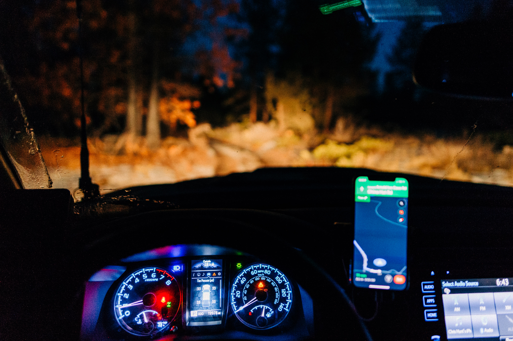

## The handoff

Today's the day. Just as I get close to Bend, my phone rings again. It's Art.
Baxter is still in the truck and still won't get out. Art needs to head to the
ranch in Maupin to get some work done, so Baxter gets to come along for the
ride. Nice!

To help make things a bit easier for Art, I offer to drive closer to the ranch
instead of meeting him in Bend. We decide on Madras, which is a 10-15 minutes
away from the ranch. I meet Art and Baxter in the McDonalds parking lot in
Madras and we make the handoff. I took some video with my phone [on
Instagram](https://www.instagram.com/huntca/).

<iframe
  width="560"
  height="315"
  src="https://www.youtube.com/embed/hQm28xICtoA"
  frameborder="0"
  allow="accelerometer; autoplay; encrypted-media; gyroscope; picture-in-picture"
  allowfullscreen>
</iframe>

## You've been promoted

And that's how we got Baxter back. He was gone for 24 days. We know a little
about the first day he was gone and we know a little about the last three days
he was gone, but there's a whooole lot of stuff that happened in the middle
we'll probably never know.

He's a survivor -  if the tornadoes weren't enough, he can now add "Maupin
Winter" to his resume. We've officially updated his title on LinkedIn from
"Couch Dog" to "Adventure Dog".

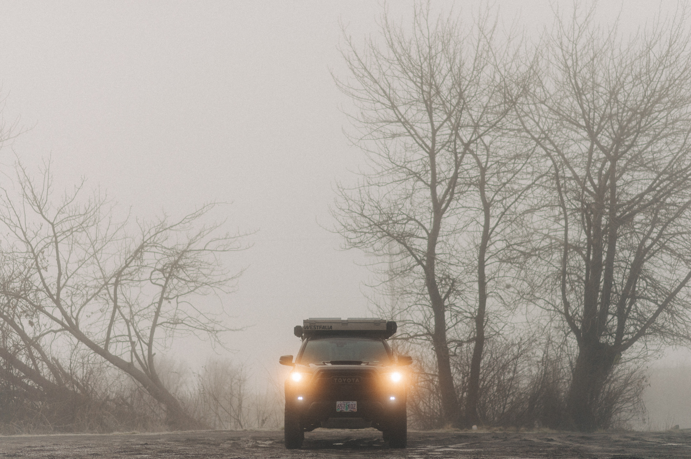

He's been home for a few days now and seems to be in surprisingly good shape.
He's lost around 15-20% of his body weight, has a limp from the coyote trap,
and needed to have a couple ticks removed (thanks Louisa, I hate ticks), but
his teeth are whiter than ever and his toenails look fantastic. His attitude
and personality seem unchanged. He behaves as if nothing happened. Just another
walk in the park I guess.

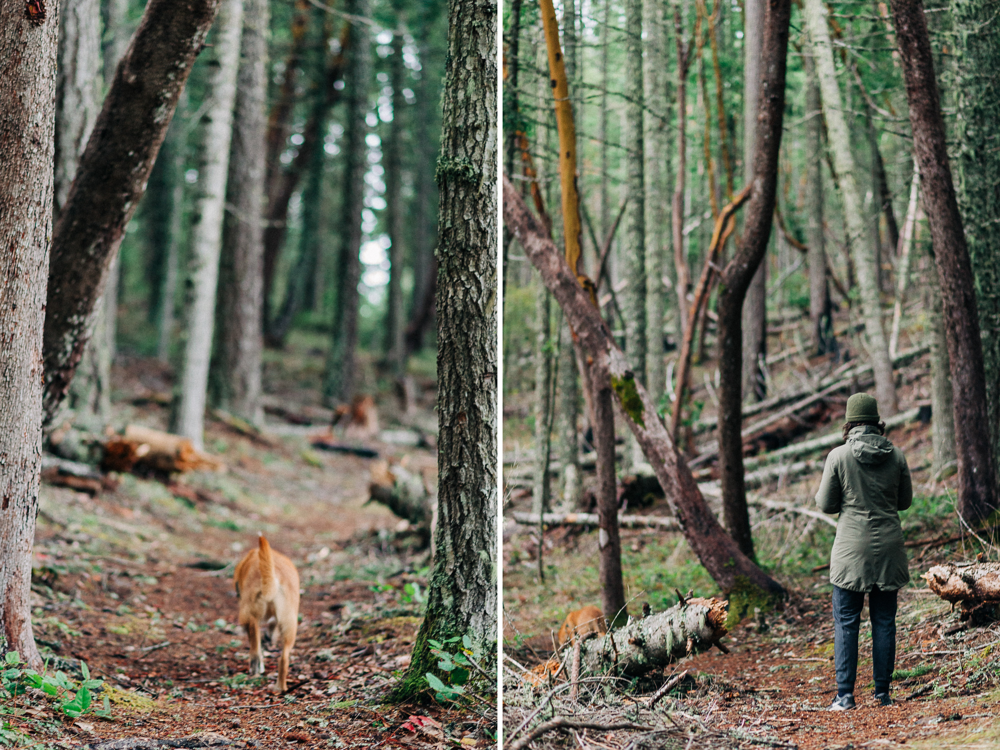

## So what now?

Time to go camping! It's going to be business as usual, except Baxter may have
a few more things attached to him when we're in the middle of nowhere (like a
leash, for example). We're thinking about getting him a vest and attaching a
[Garmin inReach Mini](https://buy.garmin.com/en-US/US/p/592606) and a bunch of
[Pawket Treats](https://www.pawkettreats.com/).

Thank you Grayson, Jeremy, Craig, Art, and everyone on the internet that helped
get Baxter home. We couldn't have done it without you! Maupin is such a
friendly/fun town and we hope to be back soon to buy everyone dinner.

---

Thanks for reading. If you'd like to get an email the next time I post
something, [subscribe here](/follow/).

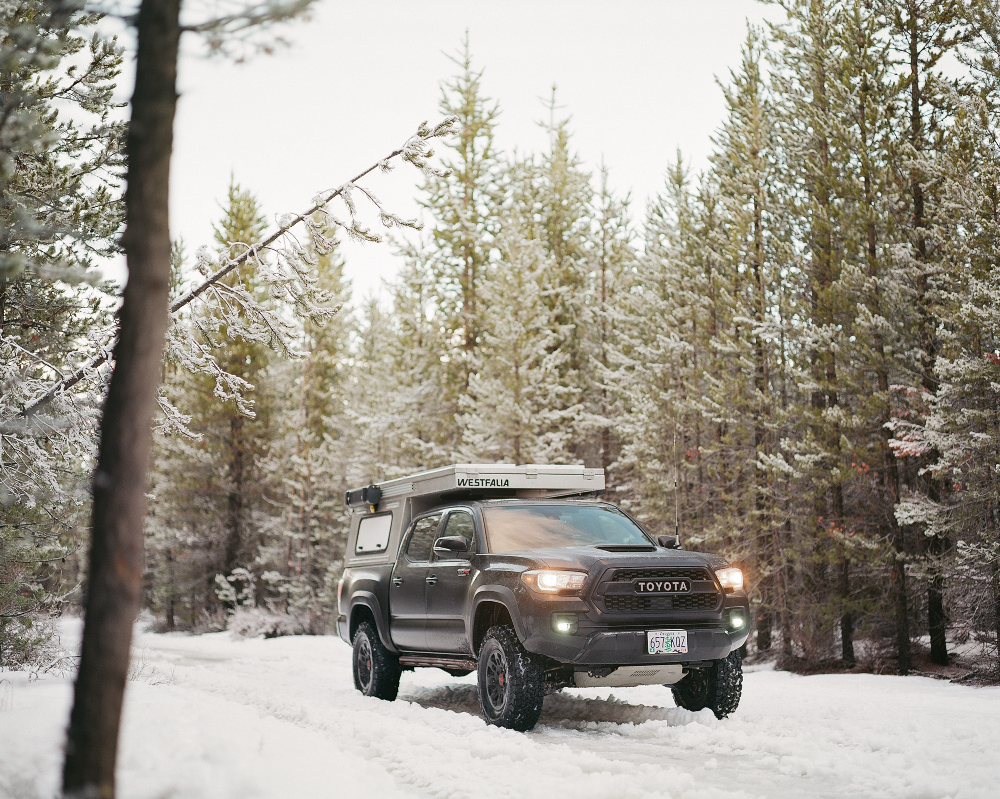

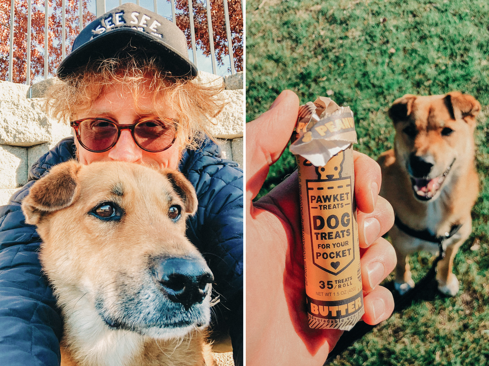
