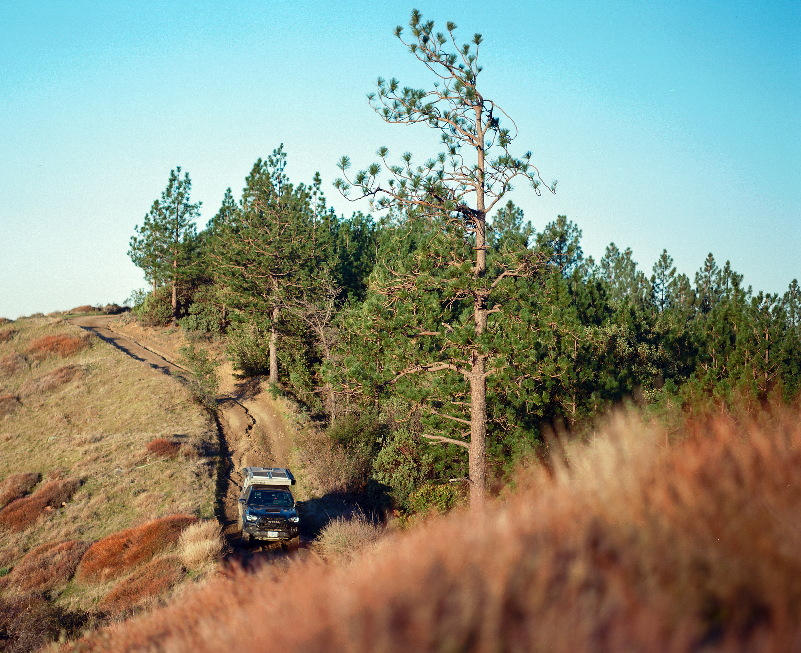

Have you seen [Highway
1](https://en.wikipedia.org/wiki/California_State_Route_1)? Louisa and Baxter
hadn't.  There's a lot of tourism and traffic along the coast and not too many
free places to camp, but once you get past [Big
Sur](https://en.wikipedia.org/wiki/Big_Sur) there's some fun to be had. A
couple years ago I explored some of these forest roads, but hadn't been back
since getting the truck.

With snow to the North and to the East, it was a good time to go the other
direction. We found the dirt after about 4 hours of driving (and some coffee).

## Clear our schedule

The [last couple trips](/sf-maupin-or) were basically rescue missions and not a
lot of time to relax and explore. This weekend was the opposite. We finally had
the dog back and a couple days with nothing to do. The plan was to drive South
and just find a place to make dinner and sleep. Our friend
[Clyde](https://www.instagram.com/frisco_native1/) recommended an area to check
out. We followed 40 miles or so of random lines on
[GAIA](https://www.gaiagps.com) that looked to go in the right direction.

Along the way we dropped pins on places that would be nice to camp someday.
We're thinking about moving to Colorado this year, so 'someday' might be a
while :)

The dirt road changed names three times and dropped up and drown the ridge, but
stayed mostly parallel to Highway 1. I supposed this would be a fun way to skip
9 miles of highway if you were just heading up the coast, but it'll add a few
hours to the trip.

## Camp, without a view

With [Johnny Cash](https://en.wikipedia.org/wiki/Johnny_Cash) on repeat, we
continued for the next couple hours in solitude, waiting for the sun to start
dropping for the night. We explored some tight tangents and found ourselves in
a couple 'oh shit' moments that involved some careful reversing and permanent
paint damage. The passenger side now has an awesome pinstripe!

spacer

spacer

spacer

## So what now?

Time to go camping! It's going to be business as usual, except Baxter may have
a few more things attached to him when we're in the middle of nowhere (like a
leash, for example). We're thinking about getting him a vest and attaching a
[Garmin inReach Mini](https://buy.garmin.com/en-US/US/p/592606) and a bunch of
[Pawket Treats](https://www.pawkettreats.com/).

Thank you Grayson, Jeremy, Craig, Art, and everyone on the internet that helped
get Baxter home. We couldn't have done it without you! Maupin is such a
friendly/fun town and we hope to be back soon to buy everyone dinner.

---

Thanks for reading. If you'd like to get an email the next time I post
something, [subscribe here](/follow/).

