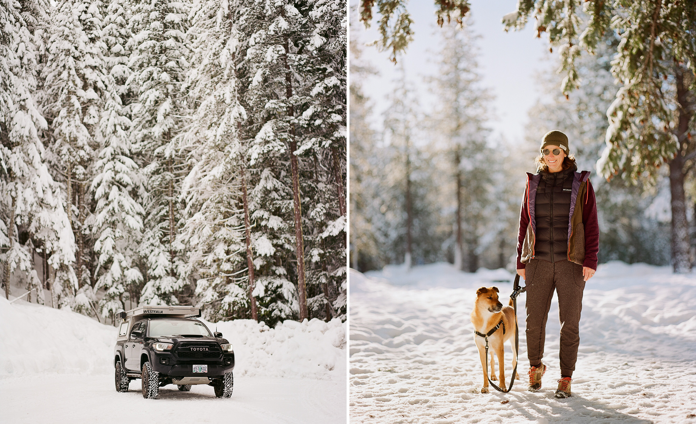
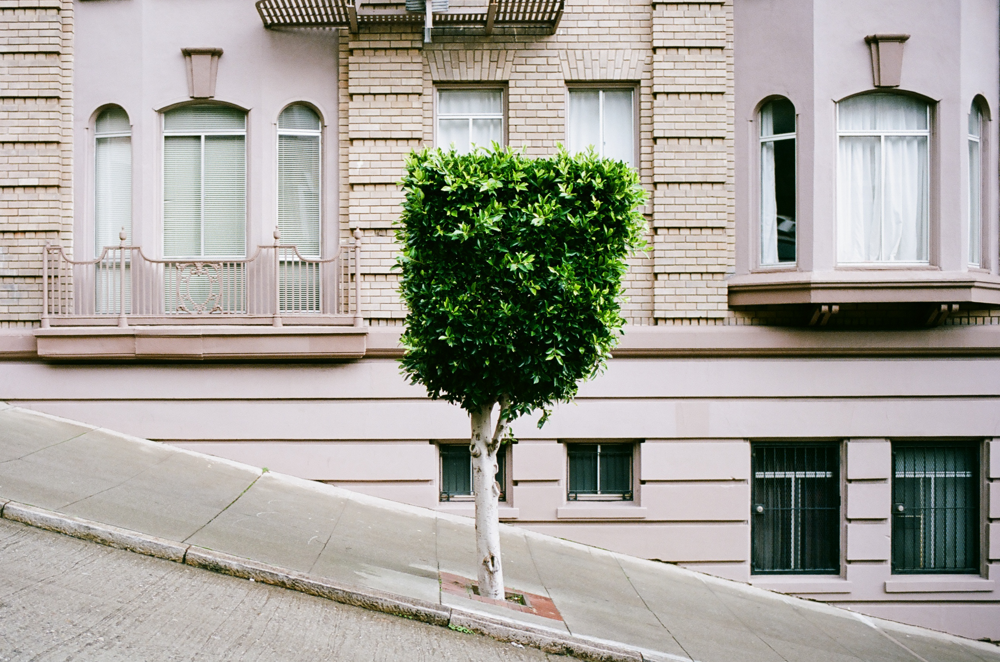
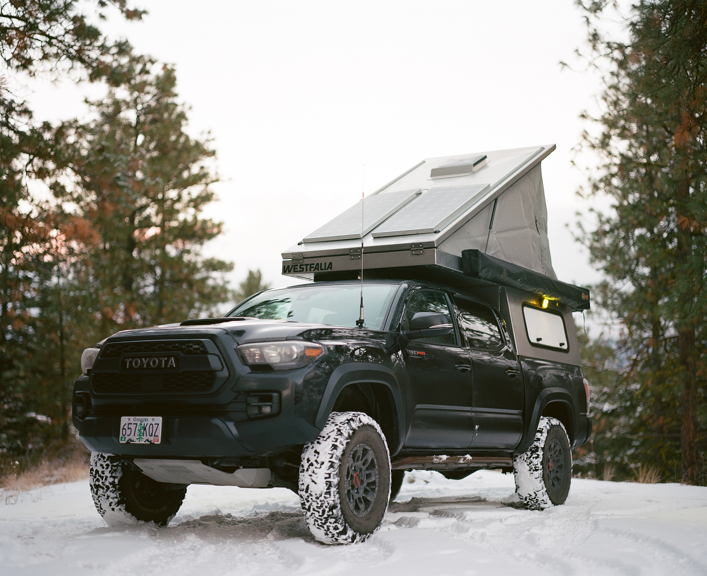
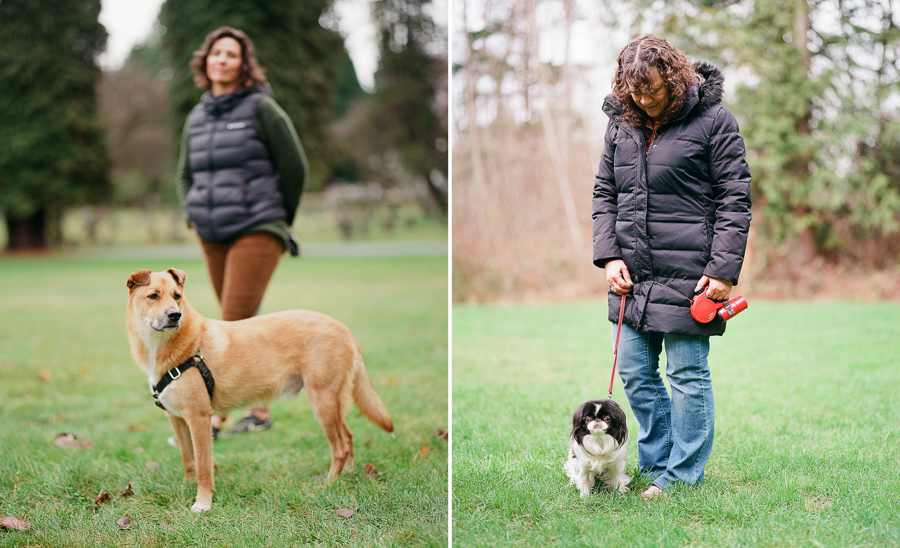
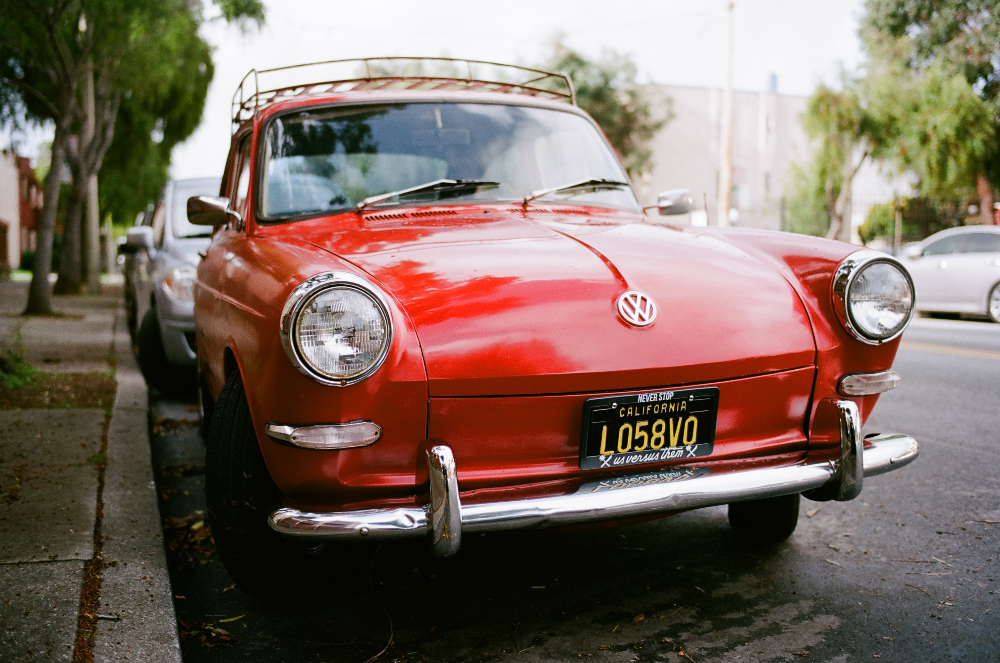

Since we decided to go on a [trip around Death
Valley](https://www.huntca.blog/ca-xmas-or) for Thanksgiving instead of
visiting family, so we were long overdue for a visit up North to the
"motherland". We had two weeks off and the plan was to take a couple days to
drive from SF to Seattle, spend a few days up there with family, then take the
rest of the time moseying our way back home through some undecided route that
probably hit Oregon, Idaho, and Nevada. This was the plan anyway - it didn't go
as planned.

After starting the trip later in the morning than expected, we made our first
stop just as we entered Oregon at Burma Pond about an hour or so off Interstate
5 near Grants Pass. It's a free dispersed campsite and has a bit of hiking that
we hit up the next morning.

Temps at night were just above freezing and it was a couple days before
Christmas, so we didn't see or hear anyone else out there. There was a vault
toilet and trash around the corner. I didn't take any photos of those because
they're ugly and I like to pretend I don't need toilets, water, or trash cans.

We arrived at camp early in the afternoon around 4PM, but it was already
completely dark when we got to the campsite. On the approach we saw something
that looked like a small controlled burn and someone had covered it in dirt (to
extinguish it), but it was still smoking heavily. Louisa poured a bunch of our
water on the smoke and probably saved the entire forest from burning while we
slept.

We fell asleep at 7PM and didn't see daylight again until 8AM. 16 hours of
darkness was a theme of the trip.

## Grants Pass to Seattle

After waiting around in the sleeping bags for the sun to finally reappear, we
got out of the truck and explored the pond. We grabbed some photos, thought
about making coffee, and hit the gravel road back to Interstate 5 for the last
450 miles to Seattle.

